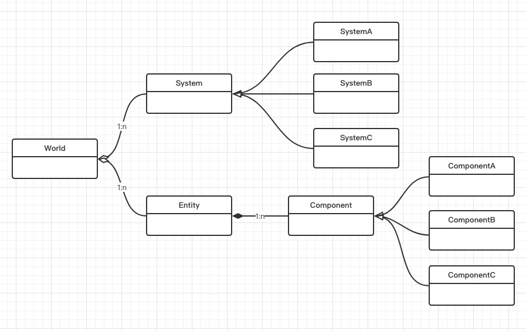
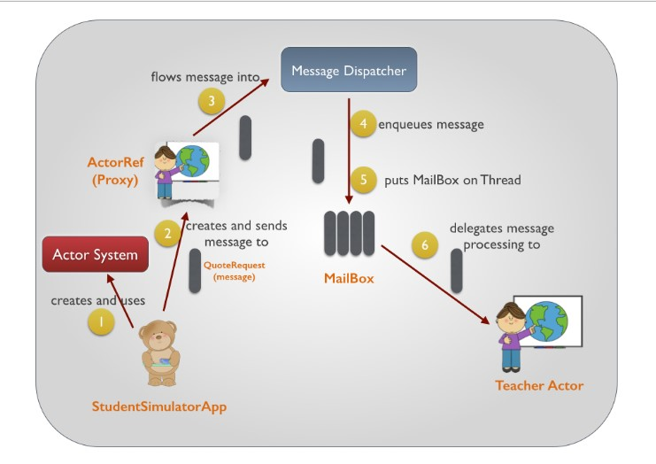

ET Game开篇
-----------------------------------
# ET介绍
> ET是一个开源的游戏客户端（基于unity3d）服务端双端框架，服务端是使用C# .net core开发的分布式游戏服务端，其特点是开发效率高，性能强，双端共享逻辑代码，客户端服务端热更机制完善，同时支持可靠udp tcp websocket协议，支持服务端3D recast寻路等等

----摘自[ET项目简介](https://github.com/egametang)

本文将针对ET后端实现的主要特点进行简单介绍，后续文章将分别详细介绍具体实现和原理。它具有以下主要特点：

* **使用C#开发**，可以很好地配合Unity游戏引擎，在前后端使用相同语言情况下，前后端代码可以得到很大程度的共用。ET本身也有包含很多前端组件，能很好地融合进unity大家族。在net core越发成熟的现在，**ET本身就具有跨平台的基因**。可以使用VS 2017在windows平台开发，也可以使用VS Code在Mac或者Linux平台下开发。

* **使用单线程多协程模式**，ET很好地使用了C#的async/await协程语法，在通过API`SynchronizationContext.SetSynchronizationContext`控制所有`Task`都在指定的线程中执行的情况下，ET控制大部分逻辑都最终在main函数中执行。当然，ET中一般是不需要使用锁的，这也算是从根本上简化了游戏功能的开发（至于为什么可以不用锁就当思考题吧）。另外，C#中的async/await语法让协程操作就像同步的函数调用一样简单。也极大地简化了编程。

* **采用ECS架构**，ECS是Entity Compent System的缩写，也有称之为ECS模型。守望先锋在借助ECS后，(点击[此处](https://blog.codingnow.com/2017/06/overwatch_ecs.html)进行了解)。ECS整体结构如下图所示：

ET里面，事件系统是其核心所在，所有逻辑处理都是基于事件流转，具体逻辑处理都是在组件中实现。ET中的组件很方便地重用了代码，通过给实体对象挂载组件对象的方式，可以动态地给实体增减功能。

* **使用actor模式**， actor指所有线程和进程都通过消息的方式相互合作，actor消息的方式去除对锁的使用，以提高程序运行效率。大体如下图所示。

ET使用actor模式的理念，为整个游戏系统中的所有实体/组件对象分配了一个唯一Id，并提供通过Id给指定实体或组件发消息的机制。在配合async/await的情况下，可以很方便地使用actor的特性。其中实体/组件是指具体实体/组件类的实例对象。具体将在后续文章中详细介绍ET中的actor的实现。

* **可以轻松地拆解系统**， actor本身是跨进程的，而且ET中，可以通过实体/组件ID很轻松访问其他进程中的实体或组件。因此，可以很方便地把一个复杂的进程拆分为多个进程，这给单机调试也提供了极大的便利。

* **底层做了很多优化**， 通信层已基本达到0GC（部分核心实现使用C语言实现） 

* **支持有限的热更**， 组件部分都可以在hotfix库中再实现。把hotfix变更反的覆盖到对应位置，通过使用重新加载hotfix组件的指令，即可实现热更。注意，ET只能热更业务逻辑代码，不能热更实体定义和实体数据。

当然ET还有很多其他优点，比如现在已经提供了对KCP,ENET,websocket,tcp的支持，也有很多可以复用的组件库。此处就不在一一说明。

# C#补充资料

**TaskCompletionSource<T>** 用于手动控制任务状态，返回的是一个Task对象。外部可以通过函数`SetResult`通知Task任务完成。具体可以参见资料:[CSharp - 在非阻塞方式下，C# 調用 TaskCompletionSource.SetResult ](http://hant.ask.helplib.com/CSharp/post_12691594)

**SynchronizationContext.SetSynchronizationContext** 这个API用于自定义Task的调度逻辑。比如ET使用它实现所有Task都放在Main函数执行。

# 总结
ET把C#语言的特性算是发挥到了极致，使用ET进行游戏开发在借助很多现在组件的情况下，可以较快实现一个完整项目。我相信ET的未来是光明的，也很期待ET辉煌到来的时刻。

# 学习资料
* 视频教程 [ET系列课程之一：C#游戏服务器框架ET开发基础](http://www.taikr.com/course/972)
* [ET 官方论坛](https://bbs.honorworkroom.com/forum.php)
* [ET github地址](https://github.com/egametang/ET)
* [ET框架个人笔记汇总](https://blog.csdn.net/qq_15020543/article/details/86766326)
* [ET官方资料](https://github.com/egametang/ET/tree/master/Book)

# 参考资料
* [ET 官方论坛](https://bbs.honorworkroom.com/forum.php)
* [ET github地址](https://github.com/egametang/ET)
* [十分钟理解Actor模式](https://www.cnblogs.com/csguo/p/7521322.html)

# 思考一下
1. 文中有提到，await/async其实是实现的协程机制，协程只是用户级线程而已，但要怎样才可以在不用锁的情况下确保数据不会出现同步问题呢。