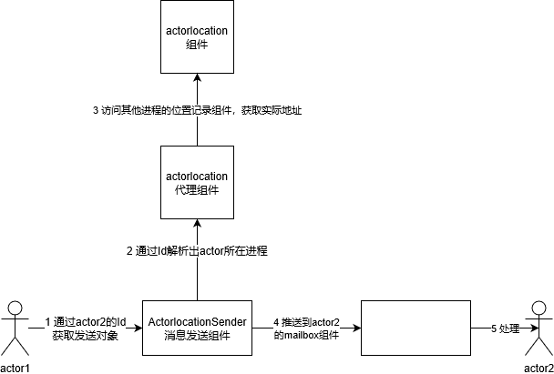
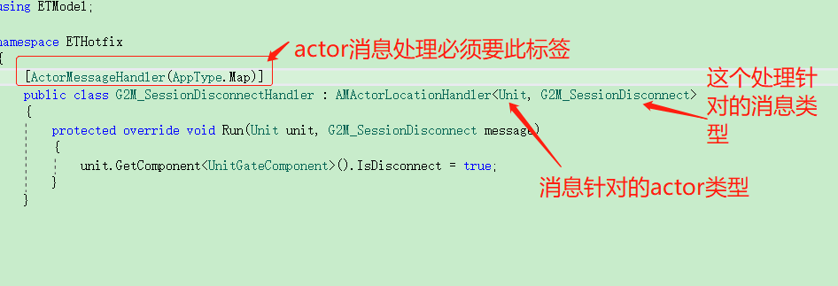
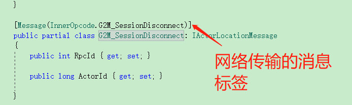

ET中的actor
----------------

# 引言

大家期待已久的actor的ET篇来啦~。从上周开始就有朋友强烈要求我早点写ET中的actor的文章，这两天也有朋友一直留言我非常期待这篇文章。非常谢谢朋友们、读者们对我的支持和认可。我也会持续写游戏后端相关技术的文章，一周3篇哈~~。后面也有个小小的调查，大家记得点点点哈。 在此，敬礼~ ~

# 正文

上篇文章有说过actor模型其实在分布式场景下更能发挥其优势。ET中的Actor也主要用于分布式环境中。它算得上是ET的点睛之笔。以下将从整体结构出发，以上帝视角来讲解。

# ET中的actor

ET中的actor是一个分布式的模型，它由三部分组成：

* **actor** 任一一个挂有**mailbox**组件的实体都可以成为一个actor。每个实体都有一个唯一的actorid

* **mailbox** 负责接收上层的传来的消息，使用C#反射方式找到对应

* **actorlocation** 负责维护actor的地址信息，以便解析出actor所在具体进程

仍然以actor1查询actor2的年龄为例，如下图所示：

1. actor1先通过**actorlocation**得到actor2的所在进程的通信地址

2. actor1通过这个地址给actor2发送消息消息

3. actor2所在进程把消息推送到actor2的mailbox

4. actor2的mailbox最后进行调度处理

大体可以参考下图流程

ET中的actor框架会为每个消息类型编号（rpc消息也会编号，在类InnerOpcode中定义），消息具体处理流程为(以下括号内容为对应代码位置)：

1. 根据消息编号，找到对应的model定义，并反射创建此对象（`Session.Run`）

2. 根据消息类型，把actor消息转发到对应实体的mailbox组件(`InnerMessageDispatcher.Dispatch`)

3. 按照不同类型的mailbox，把消息转发给对应actor消息分发器(`MailboxDispatcherComponent.Handle`)

4. actor消息分发器，调用对应的处理函数处理消息(`ActorMessageDispatcherComponent.Handle`)

其实ET把actor消息分为了两类：

1. **不需要应答的actor消息** 需要消息定义继承自接口`IActorMessage`
 
2. **需要应答的actor消息** 需要消息定义继承自接口`IActorRequest`

另外，actor消息分发器利用C#的反射机制，已事先把所有消息处理函数给搜集起来，具体可以查看源码`InnerMessageDispatcher.Load`的实现

# ET中的代码详解
如果有朋友想探索ET中的actor实现，可以从网络组件(**NetInnerComponent**)入手。因为网络组件会把收到的消息分发给到actor系统。以此为切入点即可了解到整个actor的实现

ET中actor的消息处理定义如下图所示（可参见**ActorMessageDispatcherComponent**组件的实现）

消息定义如下图所示：

# 总结

ET中的actor其实整体来说有点类似akka的实现。当然它也有分布式环境下actor模型的通病：存在死锁可能，事务咋办~~。但不管怎么说，ET的actor通过比较简洁的代码实现actor模型。而且它actor模型是直接到实体的。这给游戏中，玩家间的交互带来了极大便利。

# 参考资料
* [Actor模型](https://github.com/egametang/ET/blob/master/Book/5.4Actor模型.md)
* [Actor Location](https://github.com/egametang/ET/blob/master/Book/5.5Actor%20Location.md)

# 后记
本公众号将持续推送游戏后端开发相关文章，大家记得扫码关注哦

