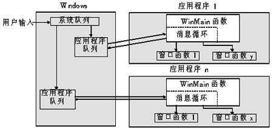
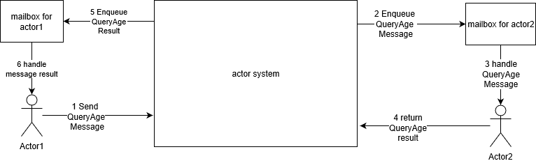

actor模型开篇--ET框架详解（3）
-------------------------

在介绍actor之前，大家先回忆下，windows窗体的消息机制。Windows为每个应用程序都有分配一个消息队列，应用程序不断从队列中读取消息，并进行处理。其中涉及到的两个主要函数为`SendMessage`和`PostMessage`——用于给一个窗口发送消息。整个流程就可以称为actor模型。整体流程如下图所示：

# actor介绍

维基百科中这样介绍actor模型

> The actor model in computer science is a mathematical model of concurrent computation that treats "actors" as the universal primitives of concurrent computation. In response to a message that it receives, an actor can: make local decisions, create more actors, send more messages, and determine how to respond to the next message received. Actors may modify their own private state, but can only affect each other through messages (avoiding the need for any locks).

译文：
> actor模型在计算机科学中是一个并行计算的数学模型,它将actors作为并行计算的原语。为了响应接收到的消息，actor可以：改变本身状态，创建actor，发送消息到其他actor，并决定如何响应接收到的下一条消息。actor可以修改自己的私有状态，但只能通过消息相互影响（避免需要任何锁）  

提前说明

* 后续单独的actor单词指一个具体的参与对象，相当于接受和处理消息的windows窗体对象

可以看出actor模型有如下特点：

* **actor的状态都是内部的，外部无法直接访问**

* **actor内部可以创建新的actor** 

*  **actor之间只能通过消息通信** 消息是actor之间通信的唯一渠道

* **actor可以向其他actor发送消息**，actor自身的状态由自己维护

* **actor本身可以决定如何处理收到的消息（包含收到还未处理的消息）**
 
一般actor模型由三部分组成：

* **actor核心(actor系统)** 负责转发消息到目标actor的mailbox，当然还有一些扩展功能也在内部实现，比如对事务的支持。actor核心有可能是由多个进程组成

* **邮箱(mailbox)** 负责暂存和调度actor的消息，用于缓存和调度所有请求，可以理解为，调用PostMessage后，消息暂存的处理方缓存（不是很恰当，但是很形象）。这个应该属于actor核心部分，但有必要单独归为一个部分

* **actor对象** 由开发者实现，负责处理具体消息，并改变自身状态，可以类比为windows窗体对象

以actor1查询actor2的年龄为例简单说明（从左往右看）：

流程细说：

1. actor1通过actor系统给actor2发出`QueryAge`的请求到actor系统内部

2. actor系统把actor1的请求推送到actor所拥有的mailbox中

3. mailbox根据actor2的情况，把`QueryAge`请求发送给actor2对象处理

4. actor2把处理结果推送给actor系统

5. actor系统把结果推送给actor1的mailbox

6. mailbox根据actor1的情况，把`QueryAge`请求发送给actor1对象处理

说明

* 整个流程中，只有actor相关逻辑由我们开发实现，其他由actor系统内部实现

* 消息从mailbox到actor时，可以根据实际情况，可以mailbox推送给actor，也可以actor主动去拉取

* actor2和actor1实际可能在同一个进程，也可能是在不同进程

# 结语

各种操作系统的同步机制用着着实繁琐，而actor就像一股清流，让并发问题可以如此优雅地解决。当然，其实actor模型本身也存在一些不足，具有如下：

* actor之间通过消息通信，这把简单问题复杂化了。如果能直接访问其状态数据岂不更好

* 有时，actor之间是存在一个流程关系，这给事务处理带来较大挑战

* actor之间本身是多线程（或多进程）的，actor之间相互通信的情况下，有可能会出现死锁情况

当然，完备的actor系统会帮我们解决上面的部分问题，比如akka(C#版叫:akka.net)，有提供事务支持。而且，actor本身就有分布式系统的特点，所以，如果一个系统是基于actor实现的，则可以很轻松地拆分为一个分布式系统。当然如何使用，还是取决于你对actor的理解

# 参考资料
* [Actor模型](https://github.com/egametang/ET/blob/master/Book/5.4Actor模型.md)
* [Actor模型原理 ](https://www.cnblogs.com/MOBIN/p/7236893.html)
* [当多线程并发遇到Actor](https://mp.weixin.qq.com/s/mzZatZ10Rh19IEgQvbhGUg)
* [Windows消息队列](https://www.cnblogs.com/lidabo/p/3695265.html)
* [Actor模式初步入门](https://www.cnblogs.com/lixiang-share/p/5829437.html)
* [Akka系列（六）：Actor解决了什么问题？ ](https://segmentfault.com/a/1190000010112122)
* [为什么Akka(Actor模型)在中国不温不火？](https://www.zhihu.com/topic/19766421/hot)
* [actor model 维基百科](https://en.wikipedia.org/wiki/Actor_model)

# 后记
本公众号将持续推送游戏后端开发相关文章，大家记得扫码关注哦

