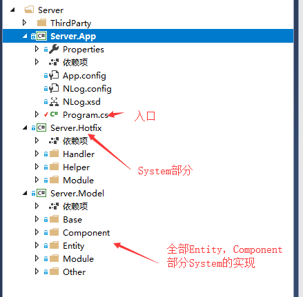
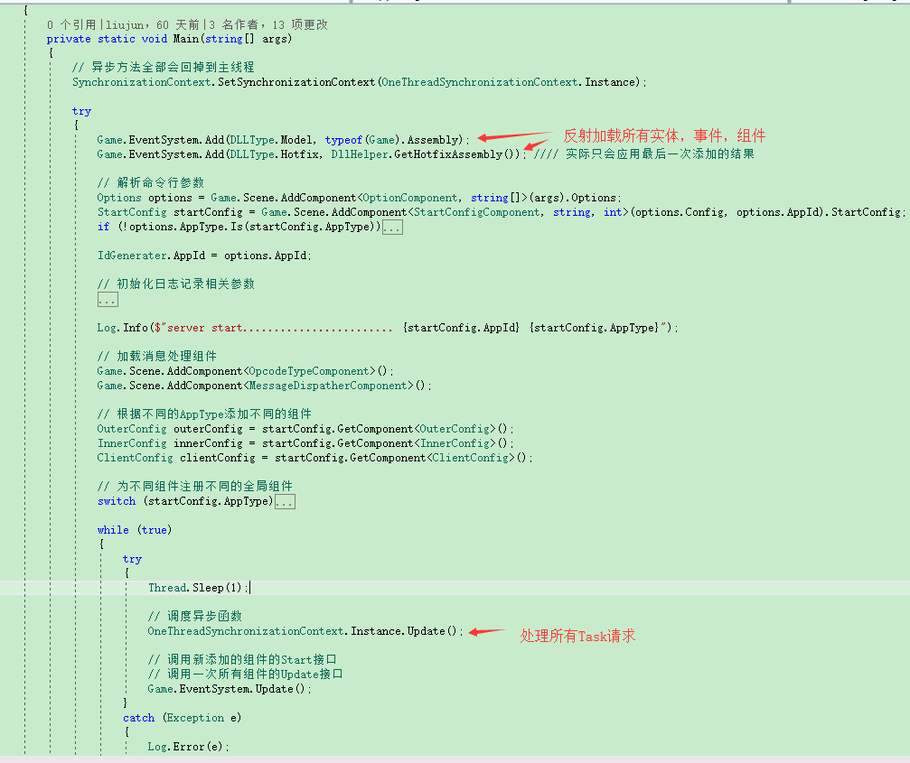

ET中的ECS(2)
----------------------------

#ECS核心
其实ECS并非只有Entity,Component,System。它还有很多具体问题需要一些其他手段解决，称之为奇技淫巧也不为过。简单说下ECS的整个内容：

* **Entity**：对应一个真实物体（至少也是一个逻辑实体）。特征：一定有一个代表这个实体的唯一Id。

* **Component**:一个实体针对某个特定片面的状态数据，比如位置数据。注意，要求只有数据不能有函数（基本的get,set类函数可以包含）

* **System**：对Entity中某些Component进行计算和更改的方法集合

* **Utility函数**：如果System之间相互依赖某些函数，则需要把这些函数提取为工具函数。也就是说，所有System之间需要确保不要太多相互依赖。

* **单例Component**：如果某个状态是全局的，而不是和某个具体实体相关的，则需要提取

按照所有文章的指向，ECS应该是《守望先锋》创造出来的，它更多地是规范代码的整体结构。结合《守望先锋》，ECS应该有如下特点：

* 把一个复杂实体拆分为多个Component，使用组合来解决继承问题，以简化复杂实体的构建（组合大法在设计模式中已经有很大的体现啦，比如：组合模式，命令模式，状态模式）

* 每个System只关注对应的Component，从而拆分关注面，每个问题都只聚焦在对应的关注数据点上。每个System的实现也会变得简单

* 在分场景或者说在一个实体不是太多的地图内，它或许是最亮眼的解决之法吧 

尽管如此，我仍需要提出如下建议

* **减少System每次遍历的实体数量** 在实体数量过多的情况下，每次事件都全部遍历所有实体将会是一件非常耗时的事情。所以使用ECS时，也需要考虑遍历的实例数量

* **ECS并不适合在多线程情况下使用** 尽量确保ECS只用在单线程环境，否则各种锁就会消耗掉极多性能

* **根据实际情况拆分实体** 从组件拆分，实体拆分两个角度，考虑把单进程拆分为多进程以提高整体性能

# ET中的ECS结构

