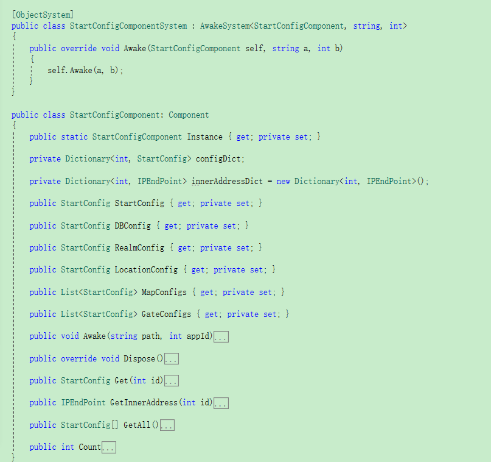

ET中的ECS(2)
----------------------------

#ECS核心
其实ECS并非只有Entity,Component,System。它还有很多具体问题需要一些其他手段解决，称之为奇技淫巧也不为过。简单说下ECS的整个内容：

* **Entity**：对应一个真实物体（至少也是一个逻辑实体）。特征：一定有一个代表这个实体的唯一Id。

* **Component**:一个实体针对某个特定片面的状态数据，比如位置数据。注意，要求只有数据不能有函数（基本的get,set类函数可以包含）

* **System**：对Entity中某些Component进行计算和更改的方法集合

* **Utility函数**：如果System之间相互依赖某些函数，则需要把这些函数提取为工具函数。也就是说，所有System之间需要确保不要太多相互依赖。

* **单例Component**：如果某个状态是全局的，而不是和某个具体实体相关的，则需要提取

按照所有文章的指向，ECS应该是《守望先锋》创造出来的，它更多地是规范代码的整体结构。结合《守望先锋》，ECS应该有如下特点：

* 把一个复杂实体拆分为多个Component，使用组合来解决继承问题，以简化复杂实体的构建（组合大法在设计模式中已经有很大的体现啦，比如：组合模式，命令模式，状态模式）

* 每个System只关注对应的Component，从而拆分关注面，每个问题都只聚焦在对应的关注数据点上。每个System的实现也会变得简单

* 在分场景或者说在一个实体不是太多的地图内，它或许是最亮眼的解决之法吧 

尽管如此，我仍需要提出如下建议

* **减少System每次遍历的实体数量** 在实体数量过多的情况下，每次事件都全部遍历所有实体将会是一件非常耗时的事情。所以使用ECS时，也需要考虑遍历的实例数量

* **ECS并不适合在多线程情况下使用** 尽量确保ECS只用在单线程环境，否则各种锁就会消耗掉极多性能

* **根据实际情况拆分实体，组件** 从组件拆分，实体拆分两个角度，考虑把单进程拆分为多进程以提高整体性能

# ET代码概要

由于讲解ECS在ET中落地时，需要提前了解下其整体代码结构，以便对ET有个整体认识。我会避开特殊代码，只做整体说明。如果感兴趣可以翻看我添加了注释的源码https://github.com/polariseye/ET （Branch_V4.0分支）。不感兴趣的朋友可以跳过此部分。

ET解决方案的整体结构如下图所示：

主函数处理流程如下图所示：

说明：

1.  `SynchronizationContext.SetSynchronizationContext`把所有Task都转到`OneThreadSynchronizationContext`处理，具体是直接交由主线程调用`OneThreadSynchronizationContext.Update`来执行所有Task

2. `Game`包含了整个游戏内容，具体包含
	* `Sence`：所有全局组件都包含在这个实体内
	* `EventSystem`：事件系统，所有自定义特性的处理，事件流转逻辑都在这里面实现
	* `ObjectPool`：对象缓存池，以便重用对象，减少GC

3. `Server.Hotfix`：包含所有需要热更的逻辑，通过查找`Game.EventSystem.Add`的引用即可知道原理细节，此处就不再赘述

# 对ET中ECS的补充
ET并未完全遵守Component只有数据的约定，有五部分是直接在Component中实现，其他大都是使用扩展函数来实现基于Component的逻辑System逻辑。也就是说，ET本身已经借助语言特性弱化了CS之间的约定。ET里面，System更多地专注在事件触发上。Component如下图的所示。

# 总结

ECS的核心在于，在使用组合的情况下，如何有效地组织Component数据和基于Component的逻辑。只要围绕这点深入思考，即可把ECS应用到其他语言的游戏框架中。

# 写在最后

本公众号将持续推送游戏后端开发相关文章，大家记得扫码关注哦

