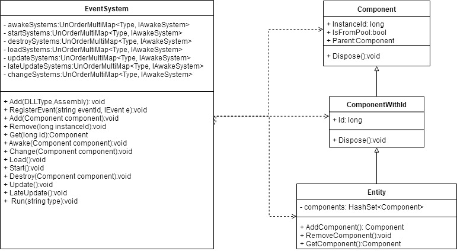
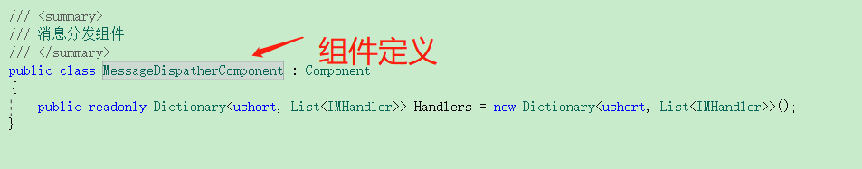
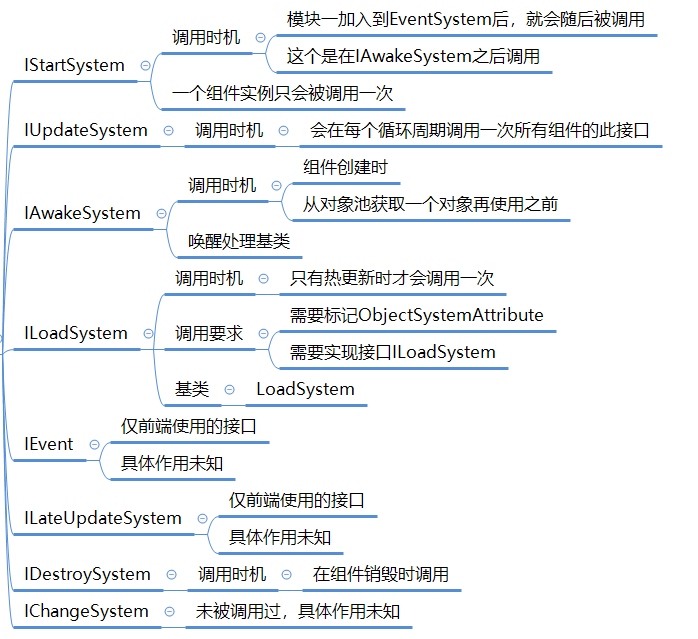
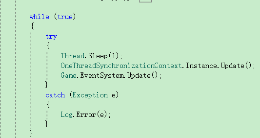
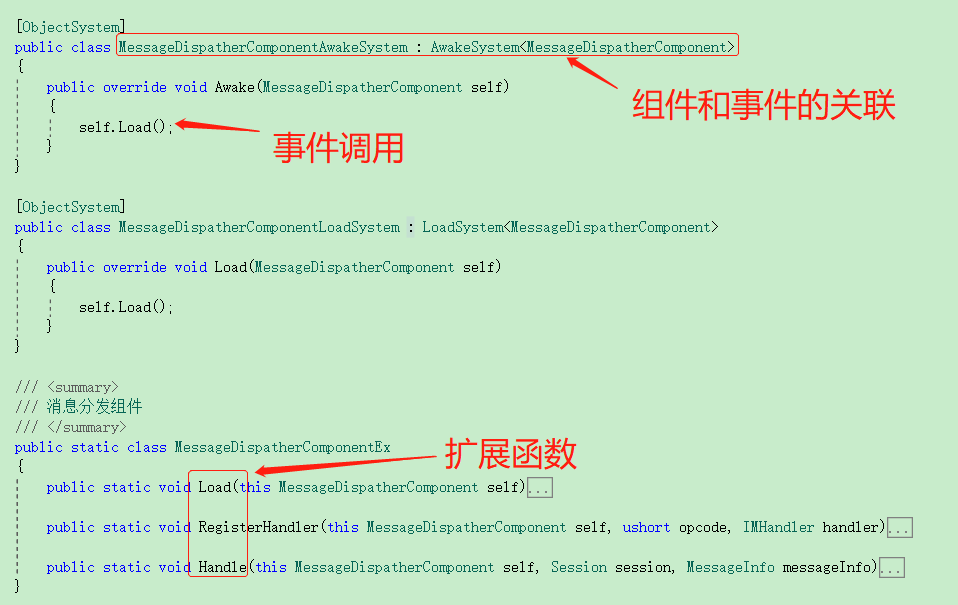

ET中的ECS
----------------------------
相信玩过守望先锋正火的朋友都有被它的死亡回放特效和流畅华丽的整体效果，还有丰富的人物技能系统吸引吧。这相比CS，CF真算是有极大创新。当然，今天我们不是讨论守望先锋有多么好玩。ECS也就是在守望先锋时候火起来的吧（不确定ECS是不是他们发明的）。本文将简单介绍这个牛逼的ECS。

# ECS 概要
如果有条件，建议先阅读参考资料中的文章《浅谈《守望先锋》中的 ECS 构架》。正文开始，ECS是`Entity Component System`的缩写，它是采用类组合的方式解决复杂的继承关系（用过虚幻引擎的朋友，有没有被继承搞得泪奔~~）。

**Entity** 是对游戏中实体对象的抽象，在ECS中，作为Component的组合，它是游戏中真实实体的生命周期管理单位。每个Entity都拥有一个唯一Id，用于标记一个具体的实体对象。

**Component** 是一个具体功能的数据信息，比如玩家的位置坐标信息。他不包含具体处理函数，具体处理放在Sytem中，当一个Entity包含对应的Component时，对应事件发生时，就会遍历找到这个Component，并进行计算更新。如果需要移除这个功能，则只需要从Entity中，移除这个Component即可。

**System** 对应着具体的功能模块，一般一个System都只专注处理一个对应的Component。它负责对关联的component中的数据进行计算处理。

举例而言：
游戏中的圆球就是一个实体，如果这个球可以动，则需要给这个球添加一个位置组件和移动的参数信息组件。系统则负责在圆球受到外力时，找到实体中的位置组件和移动的参数信息组件，并计算和改变圆球位置信息。

# ET中的ECS
ET中的ECS和ECS原始的的概念基本一致。具体如下图所示

**Entity** 所有Entity都继承自ComponentWithId，间接继承自Component,也就是说，其实所有实体也是组件，只是Entity更专注于对Component的管理。另外，ComponentWithId主要是用于Actor，作为一个可通信的组件或实体的唯一标记。

**Component** 和标准ECS一样，它只记录数据，但ET借助了C#语言扩展函数的特性，把相关逻辑处理代码通过扩展函数的形式挂接在组件上面，以简化组件功能的使用。组件定义如下图所示:

**System** 在ET中，事件系统的整体逻辑主要集中在类EventSystem中，现在包含事件:awake,start,destroy,load,update,lateupdate,change事件（大部份事件是前后端通用的）。具体含义如下图所示（前端事件未深究）

上图中IUpdateSystem是在主线程每个循环时触发一次，是直接在main函数中调用。具体代码如下:

ET中，组件和事件系统的关联如下图所示：

其他说明
* ObjectSytem标签是ET中专门用于事件定义的自定义特性。只有带有此标签的事件类才能被EventSystem类识别。

 
# 总结
ET在和ECS结合时，采用这种按照功能划分类的方式定义很多小类。虽然这种方式和真实包含关系有点不符，但这为ET热更提供了强有力的支持。而且，这种组织代码的方式也有一种别样的美感。好的代码就像一幅用心良苦，但又极其简约的山水画，不知你有get到没有。

# 上篇问题回答
C#中的async/await实际是使用状态机的方式把一个函数拆分成了多个类里的子函数，相关共享变量即为类成员字段。而Task的调度始终是以函数为单位进行调度的。所以一般情况下，ET中是不需要用锁的。

欢迎大家就以上内容在评论区提出问题，也欢迎大家提出想要了解的游戏后端开发的相关内容，我会在后续写一些相关文章。

# 参考资料
* [ECS 游戏架构 理解](https://www.cnblogs.com/FuTaimeng/p/5572183.html)
* [游戏开发中的ECS 架构概述](https://blog.csdn.net/qq_14914623/article/details/81451002)
* [浅谈《守望先锋》中的 ECS 构架](https://blog.codingnow.com/2017/06/overwatch_ecs.html)

# 写在最后

本公众号将持续推送游戏后端开发相关文章，大家记得扫码关注哦

