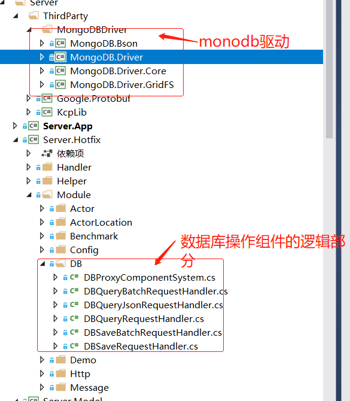
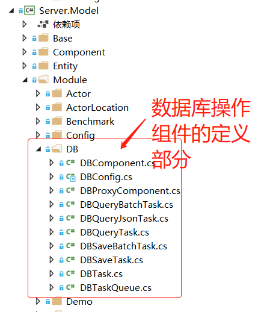
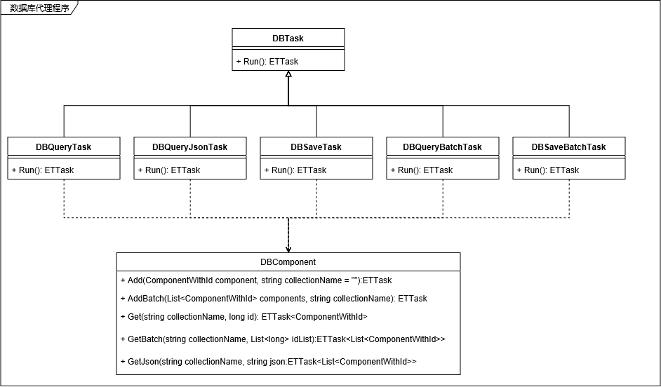

ET中的数据存储与终章
----------------------
# ET中的数据存储
ET采用MongoDb进行数据存储，并将数据存储部分拆分为单独的数据存储服务，游戏逻辑端使用数据存储代理组件处理。整体代码如下图所示：

数据库代理服务组件整体如下图所示：

可以看出，ET按照请求类型的不同拆分到不同的Task执行。实际上，ET默认是开了32个协程（代码见：`DBComponent.Awake`）来调度所有Task。当然，线程仍然是只有一个。MongoDB驱动有提供异步处理函数，所以这种方式不会阻塞主线程逻辑处理

数据库操作游戏端整体结构如下图所示：

说明：

* 游戏逻辑服务通过数据库代理组件访问数据库代理服务

* 游戏逻辑服务和数据库代理服务通过自定义的RPC进行通信

# mongodb简介

mongodb是nosql数据库分支中的一个重要代表——文档数据库。它有如下特点：

* **开源数据库** mongodb是一个开源数据库，但实际是分为社区版和企业版。区别只是企业版功能丰富些。

* **支持GridFS，可以存储大文件和海量数据** GridFS是大文件存储在mongodb中的一种规范，使用分片方式存储超过16兆的文件

* **使用Bson表示和存储数据** Bson可以理解为是json的升级版，它可以有效存储字节流数据。因为它采用Length+Data格式表示数据，所以它的检索速度比json快很多

* **非常灵活** 如果访问的数据库不存在则自动创建；如果访问的collection(相当于关系型数据库中的表)则自动创建。可以随意调整colletion中每项数据的结构，而不用做提前处理（关系型数据库表结构调整都需要用sql提前处理）

* **支持水平扩展** 网上说用两台服务器就可以将性能提升一倍，实际应该没这么夸张，但确实会提升很大的性能，具体可以简单了解下其原理就知道了

* **单机性能比mysql要好很多** [腾讯云2核4G服务器](https://cloud.tencent.com/document/product/240/7087)QPS(50%写%50读的情况下):5000 。mysql的TPS只有860

* **有sql中间件** 可以使用sql简单查询mongodb中的数据

当然以上并没有完全包含mongodb的所有特点。如需要具体了解可以查看最后的参考资料

mongodb才出现时，有很多人都感叹，这不就是为游戏而生的数据库么。经过反复思量，这点我也比较赞同。游戏数据存储有以下特点：

* **写多于读** 玩家的同一条数据一般最多只会读一次，但会反复更新。而这正是mongodb的长项

* **数据间弱关系** 一般玩家数据要么按照模块取出，要么直接全部取出，玩家的所有数据间的关系一般都比较弱化（特别是数据库端）

可以看出，关系型数据库的特点基本没有在玩家数据中有体现。特别是在mongodb也有很成熟的sql中间件时，它可以较好解决运营过程和问题排查过程对数据查询的sql的需求

网上也有测试说mongodb在有此情况下性能表现都不如mysql。这个不可否认，mongodb主打的是数据存储和简单访问。所以很多特殊操作可能确实不如mysql

最后，有没有心动？放弃mongodb可以，但至少作为游戏开发的你值得去好好了解下mongodb。或许就喜欢上了呢

# 终章

这是ET框架系列的最后一篇文章啦（以后或许会补充一些）。其中没有详解的部分包含前端部分，rpc部分。前端不在我现在熟知的范围内。rpc部分将在接下来用一系列文章详解

看了大部分ET代码后，不得不感叹作者的学识和智慧，和对知识的理解入微。好的代码就像一个艺术品。读着这篇文章的你有没有感受到呢？

# 参考资料
* [Cassandra简介](https://www.cnblogs.com/loveis715/p/5299495.html)
* [MongoDB 入门篇
](https://www.cnblogs.com/clsn/p/8214194.html
)
* [Mysql和MongoDB性能对比及应用场景分析](https://blog.csdn.net/zombres/article/details/82020931)
* [MongoDB的真正性能-实战百万用户](https://www.cnblogs.com/williamjie/p/9499847.html)
* [mongodb三种存储引擎高并发更新性能专题测试](https://blog.csdn.net/zhufengyan521521/article/details/81012816)
* [Mongodb 与 MySQL对比](https://www.cnblogs.com/web-fusheng/p/6884759.html)

# 后续计划

接下来，我会写一系列关于RPC的文章。我有用go语言实现了一个可以两边rpc的框架（还在完善中），主要借鉴了grpc和golang标准库的rpc。有兴趣的同学可以看看哈。

至于不同类型游戏的数据存储由于拆出来单看存储意义不大，所以将在后面拆解不同游戏类型的框架设计时再具体分析和设计数据存储部分。

# 写在最后

本公众号将持续推送游戏后端开发相关文章，大家记得扫码关注哦

