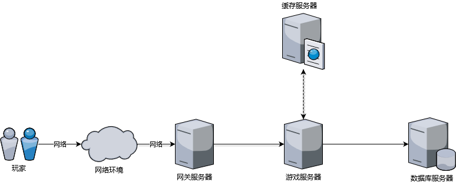

ET中的数据存储
----------------------
现有游戏一般朝着两个方向进化，一个是游戏内容展示和操作要进可能得真实且绚丽多彩，另一个各其他玩家能够进行丰富的互动且互动最好是没有时延。玩家参与游戏的整个过程如下图所示：

在整个游戏过程中影响游戏时延的大概有四个因素：客户端业务处理和图像计算，网络通信，服务器端业务复杂度，数据存储。其中，一般游戏上线之前，会对客户端处理做很多优化；网络通信这块现在有很多成熟的通信方案，比如kcp,enet；业务是游戏内容，这个一般也会通过业务拆分的方式降低响应时间；当然，数据存储根据不同游戏类型，也有些比较成熟的解决方案。本篇文章就游戏中数据存储问题对常见文案加以详细说明

首先，游戏中数据存储需要考虑如下一些问题：

1. **游戏并发量预估有多大**，一般游戏都会数据缓存在内存，并发量主要对数据库写有委强要求
2. **该使用什么类型的数据库** 比如该使用关系型数据库还是key/value数据库或其他类型的数据库
3. **整个处理过程对数据存储的时间开销有多大的容忍度**
4. **内存中的数据该以什么方式落地到数据库**

在考虑以上三个问题之前，有以下几条原则需要提前考虑：

1. **一致性（数据完整性）原则** 玩家真实数据和数据库中的数据最终需要保证一致性
2. **分析统计原则** 落地的数据可以支撑后台的数据分析和统计，不管是以什么方式支撑（可以通过日志数据分析）
3. **问题可追踪原则** 最终存储的数据可以完整支撑运营需求和排查解决线上数据，对开发人员越友好越方便越好
4. **快速响应原则** 数据存储的过程不应该对玩家请求的响应速度造成较大影响（最好没有影响），但如果由于游戏内容对延时要求不高，则此点可以适当放宽

腾讯云的游戏数据库TcaplusDB

讲解ET是如何进行数据存储的

# 参考资料
* [大数据时代的Tcaplus游戏存储](https://gameinstitute.qq.com/community/detail/102646)
* [游戏服务器的存储设计](https://www.jianshu.com/p/9436ee08895f)
* [游戏后台数据存储解决方案](https://www.jianshu.com/p/e857b49fc82f)
* [mmap和shm共享内存的区别和联系](https://www.cnblogs.com/cthon/p/9063841.html)
* [游戏服务器的数据保存](https://blog.csdn.net/codeandmore/article/details/51219855)
* [游戏服务器中的数据库异步操作技术和游戏数据的保存机制
](https://gameinstitute.qq.com/community/detail/110133)
* [游戏服务器使用MongoDB作为数据库，还有必要使用Redis缓存吗？](https://www.zhihu.com/question/29775064)
* [游戏数据库选型mysql,mongo, redis, memcached](http://www.cppblog.com/sunicdavy/archive/2015/06/19/210992.html)
* [谈谈陌陌争霸在数据库方面踩过的坑( Redis 篇)](https://blog.codingnow.com/2014/03/mmzb_redis.html)
* [社交游戏使用NoSQL数据库的4个理由](http://gamerboom.com/archives/58617)