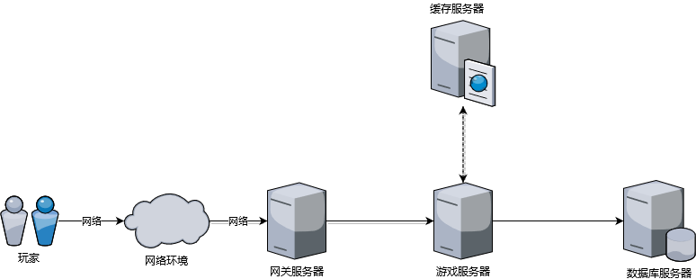

ET中的数据存储
----------------------
现有游戏一般朝着两个方向进化，一个是游戏内容展示和操作要尽可能的真实且绚丽多彩，另一个是各其他玩家能够进行丰富的互动且互动最好是没有时延。玩家参与游戏的整个过程如下图所示：

在整个游戏过程中影响游戏时延的大概有四个因素：客户端业务处理和图像渲染计算，网络通信，服务器端业务复杂度，数据存储。其中，一般游戏上线之前，会对客户端处理做很多优化；网络通信这块现在有很多成熟的通信方案，比如kcp,enet；业务是游戏内容，这个一般也会通过业务拆分的方式降低响应时间；当然，数据存储根据不同游戏类型，也有些比较成熟的解决方案。后续系列文章就游戏中数据存储问题对常见文案加以详细说明

首先，游戏中数据存储需要考虑如下一些问题：

1. **游戏并发量预估有多大**，一般游戏都会数据缓存在内存，并发量主要对数据库写有很强要求
2. **该使用什么类型的数据库** 比如该使用关系型数据库还是key/value数据库或其他类型的数据库
3. **整个处理过程对数据存储的时间开销有多大的容忍度**
4. **内存中的数据该以什么方式落地到数据库**

在考虑以上三个问题之前，有以下几条原则需要提前考虑：

1. **一致性（数据完整性）原则** 玩家真实数据和数据库中的数据最终需要保证一致性
2. **分析统计原则** 落地的数据可以支撑后台的数据分析和统计，不管是以什么方式支撑（可以通过日志数据分析）
3. **问题可追踪原则** 最终存储的数据可以完整支撑运营需求和排查解决线上数据，对开发人员越友好越方便越好
4. **快速响应原则** 数据存储的过程不应该对玩家请求的响应速度造成较大影响（最好没有影响），但如果由于游戏内容对延时要求不高，则此点可以适当放宽

# 游戏并发有多大

分区服的游戏，一般每个服玩家不会太多，玩家数据大都是每服分开存储。考虑到新服期间活跃人数会多点，每服可以计划到5000人（大厂游戏一般不在此列）。而同时在线人数计划到2000人已经是很不错了。分区游戏的玩家数据当然也可以考虑集中存储，但貌似这么干的人很少。主要是难度比较高，也更容易出错

不分区服的游戏一般指全球同服游戏，这类游戏单看并发已经没有太多意义，更多的是看一个游戏服节点能够承载多少人，支持多少人同时在线。当然，数据可以分散到以游戏节点为单位进行存储，此时，需要考虑的问题和上面的一致。也可以做数据仓库集中管理和规划，但这个需要解决很多问题（基于hadoop的数据库是否可以简化这个问题呢？）

# 该使用什么类型的数据库
不同数据库都有其擅长的领域。数据库大概可以分为以下几种类型：

* **传统关系型数据库** 代表作：mysql,oracle,sql server
* **基于hadoop的关系型数据库** 代表作：Hbase,hive
* **nosql数据库** 代表作：redis,memcache,mongodb, CouchDB

游戏可能不同于其他行业，玩家游戏过程对数据操作主要有以下特点：

1. 玩家一个操作大多时候需要查看或更改此玩家的很多数据。这些数据一般是跨数据关系型数据库中的数据行或数据表的。
2. 玩家登陆游戏时，一般会涉及此玩家的很多个模块数据的查询或呈现

从以上情况也可以看出，其实关系型数据库这种以2维数组的方式映射业务数据的方式实际并不是很适合游戏。但关系型数据库相关工具链非常成熟，而且sql这种万能语言给数据分析，数据统计，数据查询带来了极大的便利。所以，游戏数据库最终不应该脱离sql，否则，对sql的需求将会转嫁给开发人员定制实现。

nosql数据库是前几年流行起来的新型数据库。有时候真感觉，它就是为游戏而生。使用nosql数据库可以很方便地存储和读取玩家数据。也不用再提前纠结数据结构的微调带来的其他工作量(加字段，实体模型直接改即可)。当然也可以把关系型数据库当作nosql数据库使用（使用blob类型的字段）

最终来说，建议混合使用不同类型的数据库，以便集众家之所长。现在比较流行的是，日志使用关系型数据库存储。玩家数据使用nosql数据库存储。也有使用文本文件或文档数据库存储。当然玩家数据整体来说都比较敏感。不管什么数据库，数据完整性和数据一致性都需要得到保证

# 对数据存储的时间开销有多大的容忍度

不同游戏类型对游戏延迟容忍度不一样。强实时游戏一般都是争分夺秒，以前端30帧每秒为例（游戏一般要大于等于这个帧看着才流畅），我们需要在每帧的间隔时间从后端计算出结果，也就是300毫秒。其中整个网络开销一般PC端60ms,移动端100左右。也就是说，服务器一般最好是能在100毫秒内计算出结果。抛开游戏逻辑计算，数据存储基本没有什么时间可以使用。

对于类似刀塔传奇类游戏，或者挂机类游戏，它们需要很快的响应速度，但也最好不要达到秒级别，否则体验也不会太好，就以500毫秒为例，一般业务逻辑计算会比较快，而如果数据库存储一般会在200毫秒内完成。也就是说，数据库本身在其正常负载内是可以在玩家请求过程中完成数据存储的响应的。而且不会有明显的操作卡顿感觉。但一般关系型数据库性能并不是很好，[腾讯云2核4G服务器的mysql](https://cloud.tencent.com/document/product/236/8842)tps(每秒执行事务数)为：816。所以在玩家在线数据一般在1000以内时可以这么搞（而且玩家操作本身也不怎么频繁时）

# 玩家数据怎么落地到数据库

玩家数据落地到数据库一般需要结合以上两个问题考虑才行。强实时游戏中，玩家数据由于没有时间在请求时就写入到数据库，所以会有先修改内存，然后再用一些其他手段写入到数据库

对于类似刀塔传奇类游戏，或者挂机类游戏，由于他们没有在并发小的情况下，可以容忍直接写数据库。所以，可以不用做太多考虑，直接写数据库就行

# 总结

游戏中的数据存储本身就是一个多样化的需求，也没法一个方案所有游戏类型都适用。所以无法一篇文章就说文所有内容。后续会根据不同游戏的不同场景详细设计游戏存储方案和实现细节（非代码的）

# 参考资料
* [大数据时代的Tcaplus游戏存储](https://gameinstitute.qq.com/community/detail/102646)
* [游戏服务器的存储设计](https://www.jianshu.com/p/9436ee08895f)
* [游戏后台数据存储解决方案](https://www.jianshu.com/p/e857b49fc82f)
* [mmap和shm共享内存的区别和联系](https://www.cnblogs.com/cthon/p/9063841.html)
* [游戏服务器的数据保存](https://blog.csdn.net/codeandmore/article/details/51219855)
* [游戏服务器中的数据库异步操作技术和游戏数据的保存机制
](https://gameinstitute.qq.com/community/detail/110133)
* [游戏服务器使用MongoDB作为数据库，还有必要使用Redis缓存吗？](https://www.zhihu.com/question/29775064)
* [游戏数据库选型mysql,mongo, redis, memcached](http://www.cppblog.com/sunicdavy/archive/2015/06/19/210992.html)
* [谈谈陌陌争霸在数据库方面踩过的坑( Redis 篇)](https://blog.codingnow.com/2014/03/mmzb_redis.html)
* [社交游戏使用NoSQL数据库的4个理由](http://gamerboom.com/archives/58617)

# 后记
本公众号将持续推送游戏后端开发相关文章，大家记得扫码关注哦

