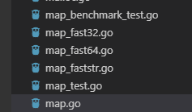

为了你好难事苦事我做了-- map语法详解
----------------------------

map实现在`runtime`包 实现代码位置:runtime/map.go

# 参考资料

* [解剖Go语言map底层实现](https://blog.csdn.net/i6448038/article/details/82057424)
* [剖析golang map的实现](https://www.jianshu.com/p/092d4a746620)