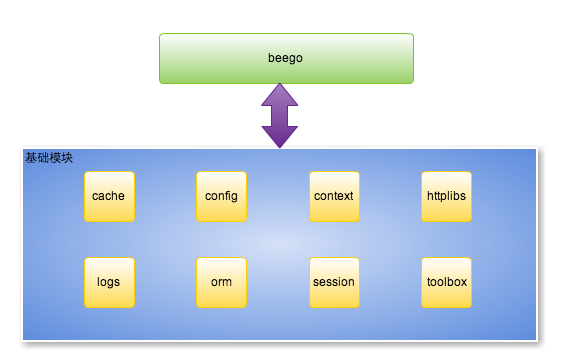

[beego中的ORM](https://beego.me/docs/intro/)
-----------------
## 简介
beego 是一个快速开发 Go 应用的 HTTP 框架，他可以用来快速开发 API、Web 及后端服务等各种应用，是一个 RESTful 的框架，主要设计灵感来源于 tornado、sinatra 和 flask 这三个框架，但是结合了 Go 本身的一些特性（interface、struct 嵌入等）而设计的一个框架

整体设计：

## ORM的使用流程
### 初始化

    // 注册驱动，默认已经注册常见的mysql、sqlit和Postgres，所以一般可以不用注册
	if errMsg := orm.RegisterDriver("mysql", orm.DRMySQL); errMsg != nil {
		fmt.Println(errMsg.Error())
		return
	}

	// 注册数据库连接,必须要注册一个名为default的连接，当作默认使用
	if errMsg := orm.RegisterDataBase("default", "mysql",
		"root:1234@tcp(127.0.0.1:3306)/operation_i_dzz?charset=utf8&parseTime=true"); errMsg != nil {
		fmt.Println(errMsg.Error())
		return
	}

	// 注册model类型，需要注意的是，结构名必须和表名基本一致（可以比表名少前缀或后缀）
	// 可以自定义表名，需要Tt实现函数TableName()string
	orm.RegisterModel(new(Tt))
	// 注册表名带有前缀的表
    orm.RegisterModelWithPrefix("p_",new(Player))

### 查

**基于orm查询**

基本代码结构

	// 新建一个操作对象
	o := orm.NewOrm()
	// 指定使用的数据库连接，默认为default
	o.Using("default")

	var data []Tt //// 定义接收数据的slice
	
	query := o.QueryTable("tt") //// 使用QueryTable指定要查询的表
	query = query.Filter("id__gte", 2) //// 添加筛选条件
    count, errMsg := query.All(&data) //// All表示接收所有数据
	if errMsg != nil {
		fmt.Println(errMsg.Error())
		return
	}

	// 打印结果
	fmt.Println("查询到记录数：", count)
	for _, item := range data {
		fmt.Printf("\r\nId:%v	Name:%v	", item.Id, item.Name)
	}

指定查询有三种方式

1. orm.NewOrm().QueryTable("表名")。用于指定查询哪个表,可以使用Filter附加复杂查询条件
2. orm.NewOrm().QueryTable(new(model类型))。用于指定查询哪个表,可以使用Filter附加复杂查询条件
3. orm.NewOrm().Read(&data, "Id")。使用指定字段的值进行数据查询

read的示例代码如下：

    // 新建一个操作对象
    o := orm.NewOrm()
    // 指定使用的数据库连接，默认为default
    o.Using("default")
    
    data := Tt{}  //// 定义接收数据的slice
    data.Id = 1   //// 指定查询条件
    errMsg := o.Read(&data, "Id") //// 指定使用哪一列进行查询
    if errMsg != nil {
    	fmt.Println(errMsg.Error())
    	return
    }
    
    // 打印结果
    fmt.Printf("查询到的值：name:%v", data.Name)

-----------
**基于sql的查询**

基于sql查询需要调用orm.NewOrm().Raw()执行查询

	// 创建Orm对象
	o := orm.NewOrm()
	// 执行sql
	result := o.Raw("select Id,Name from tt limit 10") // 执行sql语句

	var ( // 定义用于接收返回值的slice
		idList   []int
		nameList []string
	)

	// 获取结果
	count, errMsg := result.QueryRows(&idList, &nameList)
	if errMsg != nil {
		fmt.Println(errMsg.Error())
		return
	}

	// 打印结果
	fmt.Println("查询到记录数：", count)
	for index, _ := range idList {
		fmt.Printf("\r\nId:%v	Name:%v", idList[index], nameList[index])
	}

-----------

### 增
1. orm.NewOrm().Insert(&data),插入单条记录
2. orm.NewOrm().InsertMulti(dataCount,&dataArray),插入指定数量的记录

备注：

* 使用Insert插入数据成功了，但影响的行数却为0

插入多条数据的代码如下：

	users := []User{
	    {Name: "slene"},
	    {Name: "astaxie"},
	    {Name: "unknown"},
	    ...
	}
	successNums, err := o.InsertMulti(100, users)

### 删

	o := orm.NewOrm()
	if num, err := o.Delete(&User{Id: 1}); err == nil {
	    fmt.Println(num)
	}

### 改

	o := orm.NewOrm()
	user := User{Id: 1}
	if o.Read(&user) == nil {
	    user.Name = "MyName"
	    if num, err := o.Update(&user); err == nil {
	        fmt.Println(num)
	    }
	}

### 事务

事务是以orm.Ormer为单位的，也就是说，如果要进行事务操作，需要新建一个orm.Ormer。代码如下：

	// 新建一个操作对象
	o := orm.NewOrm()
	// 指定使用的数据库连接，默认为default
	o.Using("default")

	if errMsg := o.Begin(); errMsg != nil {
		fmt.Println(errMsg.Error())
		return
	}

	// 事务结果操作
	isOk := false
	defer func() {
		if isOk {
			o.Commit() // 提交事务
		} else {
			o.Rollback() // 回滚事务
		}
	}()

	// 插入记录
	if _, errMsg := o.Insert(&Tt{
		Id:   3,
		Name: "h3",
	}); errMsg != nil {
		fmt.Println(errMsg.Error())
		return
	}

	// 更新数据
	if _, errMsg := o.Update(&Tt{
		Id:   1,
		Name: "h1",
	}); errMsg != nil {
		fmt.Println(errMsg.Error())
		return
	}

	// 设置处理成功
	isOk = true

## 总结

**优点：**

1. 此ORM对CRUD支持比较好，单表操作整体也比较方便
2. 使用此ORM可以不用了解sql语句
3. filter对where语句的构建具有良好的支持
4. 对多数据库的支持比较好

**缺点：**

1. 由于封装太彻底，对查询条件的构建比较麻烦（但除了针对排行榜取数据的需求外，整体还可以接受）
2. 所有model都需要提前注册到orm框架中
3. 对原始的sql查询支持不是很好，数据都是按列返回的，当然orm.RawSeter.QueryRow和orm.RawSeter.QueryRows直接转换为对象和对象集合
4. 暂无办法实现，单协程的所有操作同时回滚（这对资源的消耗和获得处理会比较麻烦）