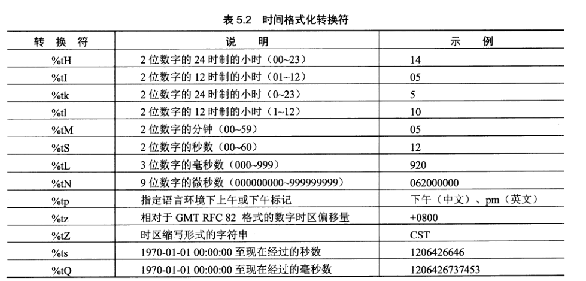
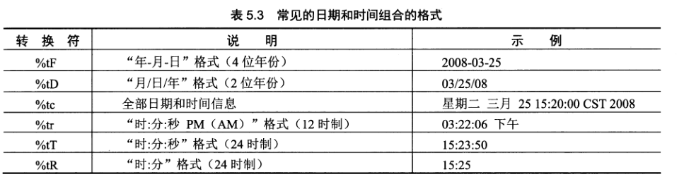
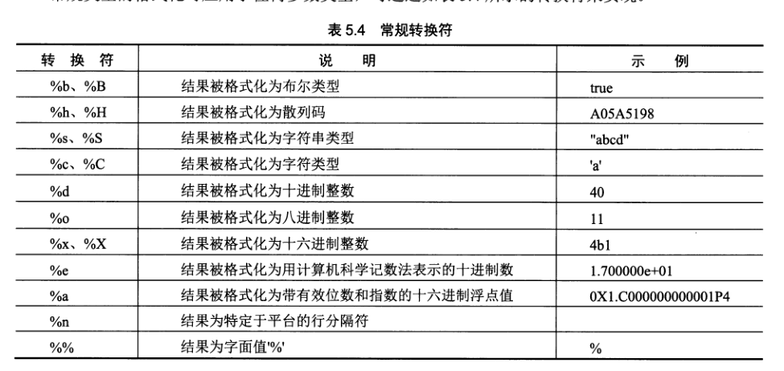

java基础
--------------------------
# java简介

java 特点
1. 被设计为可移植，跨平台的语言

2. 既是解释执行语言，也是编译语言。先编译为中间字节码，再对字节码解释执行。中间字节码在所有虚拟机中都可以执行

3. 是一种纯面向对象的程序设计语言

4. 可以通过URL（统一资源定位符）对对象进行访问，访问方式与访问本地系统相同

5. 安全没有指针，由JVM（JAVA程序执行的载体）

6.  可以动态调整库中的方法和增加变量，而客户端不需要做任何改动

Java版本
1. Java SE全称为`Java2 Platform Standard Edition`:适用于桌面系统的Java 2平台标准版

2. Java ME全称为`Java2 Platform Micro Edition`:适用于小型设备和智能卡的Java2平台Micro版

3. Java EE全称为`Java2 Platform Enterprise Edition`:适用于创建服务器应用程序和服务的Java 2平台企业版

# 安装
1. 下载地址:[Oracle的官网](https://www.oracle.com/technetwork/java/javase/downloads/index.html)

2. 配置环境变量,需要修改的环境变量如下
````
JAVA_HOME:安装目录
PATH:%JAVA_HOME%\bin;%JAVA_HOME%\jre\bin
````
最新版本貌似没有jre的配置

# 编译和运行
源码tst.java
````
public class Main {

	public static void main(String[] arg) {
		System.out.println("今天天气好好啊");
	}
}

````
编译：``javac tst.java``
执行： ``java Main``,如果是带UI的程序，则需要使用``javaw Main``,区别是java是针对控制台程序，javaw是针对窗体应用程序

重要说明：
* 如果main函数所在class没有在默认package，则需要把生成的class文件放在package对应的文件夹目录中，否则会提示找不到类

# 语法

## 类定义

````
访问权限 class 类名 {
	访问权限 数据类型 变量名;
	访问权限 返回的数据类型 变量名(参数列表) {
	}
}
````

类是java程序的基本单元。类定义要求:
1. 每个文件只能定义一个类,

2. 类名必须和文件名相同

3. 类名只能是字母（unicode编码的，可以是汉字），数字，下划线，美元符号($)，第一个不能是数字，不能是Java中的保留关键字

4. 类名区分大小写（java中的所有标识符都区分大小写）  

包含main函数的类可以称为主类。一个java程序可以拥有多个主类。

主类具体要求:
1. 类必须是public

2. main的签名需要是：`public static void main(String[]args)`

导入类库 ``ipmort 类库名;``

## 数据类型与变量

**整型**
* 十进制：不能以0开头
* 八进制：以0开头
* 十六进制：以0x或0X开头

byte:1byte
short:2byte
int:4byte
long:8byte

**浮点型**

float:4byte
double:8byte

数值后面加f代表是float类型，否则认为是double类型

**字符**
char:2byte（无符号整数）
内存中，字符使用unicode码表示

**转义字符**
同C++

**布尔值**
boolean b=true;

**变量**
标识符只能是字母（unicode编码的，可以是汉字），数字，下划线，美元符号($)，第一个不能是数字组成，不能是Java中的保留关键字.

**变量类型**

声明变量:``int age=1;``
声明常量:``final int AGE=1;``,常量名一般用大写字母。需要在类中声明常量时赋值
声明静态变量:``static int y = 90;``,通过``类名.变量名``访问

**有效范围**

局部变量：对应的花括号范围内有效，同名的局部变量会隐藏对应的外部变量。在对应方法执行结束时，释放局部变量所占内存

** 算术运算符**
`+ - * / %`
````
int a = 100; //// 赋值运算符
int b = 1;

b = a-b; //// 算术运算符 + - * / %
````
++,--
````
++a(--a)
a++(a--)
````

**比较运算符**
`> < == >= <= !=`

**逻辑运算符**
逻辑与：&& & （两种与法都可以）
逻辑或：||
逻辑非：!

**位运算符**
按位与：&
按位或：|
按位取反：~
按拉异或：^
移位操作:<< >>
无符号右移位操作:>>>

**三元运算符**
boolean isOk = 1>2?true:false;

**优先级**
自加，自减>算术运算>比较运算>逻辑运算>赋值运算

**类型转换**
隐式转换:byte->short->int->long->float->double
显式转换:`int a=(int)123.23;`

**注释**
单行注释：`// 注释内容`
多行注释：`/* 注释内容 */`
文档注释：`/** */`文档注释会被javadoc识别

## 编码规范
* 每条语句单独占一行，且以分号结束

* 声明变量时，每个变量单独占一行，以便于为变量添加注释

* 关键字与关键字之间只需要一个空格，多个会补忽略

* 不建议使用技术含量特别高的语句

* 关键方法多加注释

## 流程控制
复合语句（语句块）:对应一对花括号{}

**if条件语句**
````
if(布尔表达式){
	语句
}
else if(布尔表达式){
	语句
}
else {
	语句
}
````

**switch多分支语句**
````
switch(表达式)
{
	case 常量值1:
		语句块
		[break;]
	case 常量值n:
		语句块
		[break;]
	default:
		语句块
		[break;]
}
````
重要说明

* switch中表达式和case中的常量值都必须是整型，字符，字符串

* switch中各个条件不能相同 

* **如果不加break,则会从匹配的条件开始执行完下面的所有case语句和default语句，而不管是否符合case条件**

**while循环**
````
while(条件表达式)
{
	语句
}
````

**do..while循环**
````
do
{
}
while(条件表达式);
````

**for循环**
````
for(初始化表达式1;条件表达式2;循环后操作表达式3)
{
}
````

**foreach循环**
````
int arr[] = {1,2,3};
foreach(int x:arr){
	System.out.println(x);
}
````

**循环控制**
````
int arr[] = {1,2,3};
foreach(int x:arr){
	if (x<3){
		continue; //// 跳过当次循环
	}
	
	break; //// 退出循环
}
````
也可以`break 标签名`跳出到指定循环
````
loop1:for(int i=0;i<10;i++){
	for(int j=0;j<i;j++){
		if(j==8){
			break loop1;
		}
	}
}
````

continue也可以添加标签名：`continue 标签名;`,用于跳过指定循环体的当前循环，进入下次循环

## 字符串
````
String a = "nihao";
String b = "nihao";
String c =new String("nihao");

if(a==b) { //// 由于a和b都指向了"nihao"这个字符串常量对象，所以a=b
	System.out.println("a=b");
}

if(a==c) //// 由于c是使用new创建的新对象，所以 a不等于c
{
	System.out.println("a=c");
}

if(a.equals(c)) { //// 由于比较的是值，所以a=c
	System.out.println("2 a=c");
}

String d="ni"+"hao;"+123; //// 使用+号连接字符串，也可以连接其他类型的数据
````
说明

* 必需要初始化后才能使用，否则编译不过

* 使用`new`会使用String的构造函数创建一个新对象

* 在比较字符串时，需要使用equals函数，否则结果可能不符合预期

* 使用'+'连接字符串:`String a="ni"+"hao";`,也可以连接其他类型的数据

* 字符串不能写成多行，多行只能使用+号连接

**格式化字符串**

````
System.out.println(String.Format("当前时间:%te",new Date())) //// 时间格式化
```` 
* 日期时间格式化




**正则表达式**

````
String a="123";
a.matches("\\d+")
````

**字符串操作说明**

String:每次都生成一个固定长度的字符串，使用+会生成一个新的字符串
StringBuilder:长度可变，可以对字符串进行相关操作，频繁对字符串操作时，它效率更高

## 数组
``数据类型 变量名[]=new 数组元素类型[元素个数]`` 或 ``数据类型[] 变量名=new 数组元素类型[元素个数]``
````
int a[]=new int[10]; //// 声明和创建一个数组

int b[]=new int[]{1,2,3}; //// 创建并初始化数组
int c[]= {1,2,3}; //// 创建并初始化数组

int d[][]; //// 声明一个2维数组  

int[][] e=new int[2][]; //// 声明并创建一个2维数组
e[0]=new int[2];
e[1]=new int[3];

int[][] f = {{1,2}{3,4,5}}; //// 声明并初始化一个2维数组
````

说明：

* 分配后，数组的各元素的初始值为对应0值
* 数组相关操作函数在Arrays类的静态函数,需要`import java.util.Arrays;`

## 类和对象
````
public class Man{
	private String name;

	public String getName(){
		return "nihao";
	}

	public String setName(String name){
		this.name=name;
	}

	// 构造函数
	public Man(String defaultName){
		this.name=defaultName;
	}
}
````
权限修饰符：public prive protected
this关键字:指向自身的指针
构造函数：和类同名

**静态变量**


# 其他

javadoc如何使用


eclipse常用快捷键
* 代码智能提示：`alt+/`
* 添加、移除断点：`ctrl+shfit+b`
* 开始调试：`F11`
* 停止调试：`ctrl+F2`
* 单步调试(会进入函数)：`F5`
* 单步调试（不进入函数）：`F6`
* 跳过到下个断点：`F8`