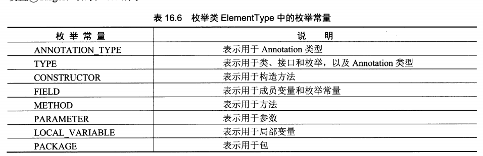
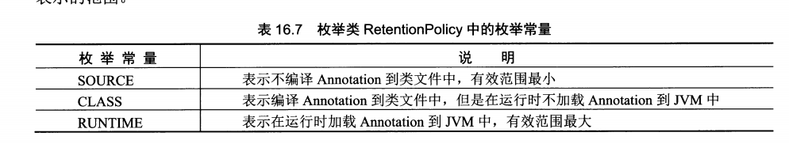

高级应用
-----------------------
# 反射
包：`java.lang.reflect`

````
import java.lang.reflect.*;

import Hello.*;

public class tst {
	public static void main(String[] arg) {
		Class tp = Human.class;
		System.out.println("package name:" + tp.getPackageName());
		System.out.println("class name:" + tp.getSimpleName());

		System.out.println("-----------------------------------------");
		// 获取所有public字段
		for (Field f : tp.getFields()) {
			System.out.println("field name:" + f.getName());
		}

		System.out.println("-----------------------------------------");
		// 获取public方法
		for (Method m : tp.getMethods()) {
			System.out.println("method name:" + m.getName());
		}

		System.out.println("-----------------------------------------");
		// 获取所有所有字段
		for (Field f : tp.getDeclaredFields()) {
			System.out.println("field name:" + f.getName());
		}

		// 获取所有方法
		for (Method m : tp.getDeclaredMethods()) {
			System.out.println("method name:" + m.getName());
		}
	}

}
````

* get+功能名()的方法只获取包含基类的public成员:`getFields()`

* getDeclared+功能名()的方法获取当前类定义的所有成员，包含非public的。但不包含父类的成员:`getDeclaredFields()`

* getConstructor访问构造函数

## Annotation功能
````
import java.lang.annotation.ElementType;
import java.lang.annotation.Retention;
import java.lang.annotation.RetentionPolicy;
import java.lang.annotation.Target;

// 定义Annotation
@Target(ElementType.TYPE)
@Retention(RetentionPolicy.RUNTIME)
public @interface MyAnnotation {
	String value();
	
	Class type();
}

// 使用Annotation
@MyAnnotation(value = "nihao", type = Human.class)
public class Human {}

// 访问类中的Annotation
public class tst {
	public static void main(String[] arg) {
		Class tp = Human.class;
		var annotationObj= (MyAnnotation)tp.getAnnotation(MyAnnotation.class);
		
		System.out.println(annotationObj.value());
		System.out.println(annotationObj.type().getName());
	}
}
````
* 实际Annotation是一个继承自`java.lang.annotation.Annotation`的接口，使用`@interface`定义

* 使用@target来标记针对的目标类型，参数取值为ElementType

* 使用@RetentionPolicy来标记Annotation信息的有效范围。参数取值RetentionPolicy

* 使用反射中Class类的函数:`getAnnotation`(获取),`isAnnotationPresent`(是否存在)等函数访问   





# 枚举与泛型
# 多线程
# 网络通信
# 数据库操作