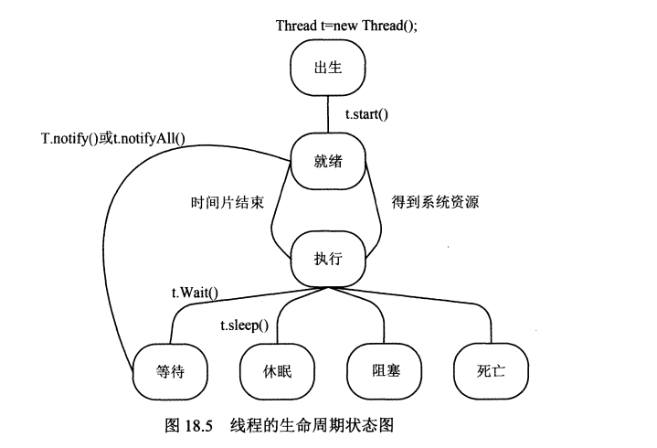

高级应用
-----------------------
# 反射
包：`java.lang.reflect`

````
import java.lang.reflect.*;

import Hello.*;

public class tst {
	public static void main(String[] arg) {
		Class tp = Human.class;
		System.out.println("package name:" + tp.getPackageName());
		System.out.println("class name:" + tp.getSimpleName());

		System.out.println("-----------------------------------------");
		// 获取所有public字段
		for (Field f : tp.getFields()) {
			System.out.println("field name:" + f.getName());
		}

		System.out.println("-----------------------------------------");
		// 获取public方法
		for (Method m : tp.getMethods()) {
			System.out.println("method name:" + m.getName());
		}

		System.out.println("-----------------------------------------");
		// 获取所有所有字段
		for (Field f : tp.getDeclaredFields()) {
			System.out.println("field name:" + f.getName());
		}

		// 获取所有方法
		for (Method m : tp.getDeclaredMethods()) {
			System.out.println("method name:" + m.getName());
		}
	}

}
````

* get+功能名()的方法只获取包含基类的public成员:`getFields()`

* getDeclared+功能名()的方法获取当前类定义的所有成员，包含非public的。但不包含父类的成员:`getDeclaredFields()`

* getConstructor访问构造函数

## Annotation功能
Annotation是一种给代码添加一些静态元数据的一种方式，和C#的自定义特性是一样的
````
import java.lang.annotation.ElementType;
import java.lang.annotation.Retention;
import java.lang.annotation.RetentionPolicy;
import java.lang.annotation.Target;

// 定义Annotation
@Target(ElementType.TYPE)
@Retention(RetentionPolicy.RUNTIME)
public @interface MyAnnotation {
	String value();
	
	Class type();
}

// 使用Annotation
@MyAnnotation(value = "nihao", type = Human.class)
public class Human {}

// 访问类中的Annotation
public class tst {
	public static void main(String[] arg) {
		Class tp = Human.class;
		var annotationObj= (MyAnnotation)tp.getAnnotation(MyAnnotation.class);
		
		System.out.println(annotationObj.value());
		System.out.println(annotationObj.type().getName());
	}
}
````
* 实际Annotation是一个继承自`java.lang.annotation.Annotation`的接口，使用`@interface`定义

* 使用@target来标记针对的目标类型，参数取值为ElementType

* 使用@RetentionPolicy来标记Annotation信息的有效范围。参数取值RetentionPolicy

* 使用反射中Class类的函数:`getAnnotation`(获取),`isAnnotationPresent`(是否存在)等函数访问   

* 如果只有一个字段，且名为value，则可以不指定字段名 


# 枚举
````
public enum HumanEnum {
	Man,
	Woman
}

public enum HumanEnum2 {
	Man(1), //// 使用构造函数HumanEnum(int val)初始化
	Woman(2);

	public int value;
	
	private HumanEnum(int val){
		this.value = val;
	}
}
````

* 可以把枚举看成一个类，所有枚举都继承自`java.lang.Enum`

* 枚举可以有构造函数，但是枚举的构造函数都必须是private，此时，枚举项都需要调用对应构造函数声明枚举项

* 枚举也可以有字段，和普通类定义一致

* 默认的类型是整型

# 泛型

````
public class TestClass<T1 extends List,T2>{
	private T1 obj;
	private T2 obj2;
}
````  
* 使用`extends`限制泛型的类型，不管是类还是接口，都需要使用`extends`关键字

* 定义某个变更时，使用通配符`?`限制具体类型必须实现某个接口或继承某个类:`A<? extends List> a=new new A<ArrayList>();`。如果实例化的类型不是指定的子类或接口实现，将无法编译通过

* 继承过程中，如果没有指定泛型类型，则就相当于是Object
````
public class ExtendClass<T1>{
}
public class<T1,T2,T3> extends ExtendClass{
}
```` 
* 泛型的类型参数不能是简单类型，如`ArrayList<int>`会编译不过

# 多线程
主要包含:`java.lang.Thread`和`java.lang.Runable`

**通过继承Thread实现创建线程**
````
import java.lang.Thread;
import java.util.Date;

public class TstThread extends Thread {
	public void run() { //// 重写run函数
		while(true) {
			try {
				Thread.sleep(1000);
			} catch (InterruptedException e) {
				e.printStackTrace();
			}
			
			System.out.println((new Date()).toString());
		}
	}
}

public class tst {
	public static void main(String[] arg) {
		Thread th=new TstThread();
		th.start(); //// 调用start函数运行线程
		
		try {
			System.in.read();
		} catch (IOException e) {
			// TODO Auto-generated catch block
			e.printStackTrace();
		}
	}
}
````

**通过Runable接口实现创建线程**

````
public static void main(String[] arg) {
	Thread th = new Thread(new Runnable() { //// 使用匿名内部类创建Runnable的实现
		public void run() {
			while (true) {
				try {
					Thread.sleep(1000);
				} catch (InterruptedException e) {
					e.printStackTrace();
				}
				
				System.out.println("wqni");
			}
		}
	});

	th.start(); //// 开起线程

	try {
		System.in.read();
	} catch (IOException e) {
		e.printStackTrace();
	}
}
````

* 对同一个对象使用`start`调用将会抛出异常
* 不建义对线程使用stop，因为stop会立即结束线程。而是建议让线程正常退出



**线程同步**

java为每个对象都有分配有一个标识位，取值：0，1，进入同步段的代码，会把它设置为0，退出会还原为1
* 使用`synchronized`进行代码块同步(类似C#中的lock关键字):

````
synchronize(obj){

}
````
* 使用`synchronized`进行方法同步:

````
public class Cls{
	private int i;
	public synchronized void Tst(){ //// 标记为这个方法整个为同步段
		this.i++;
	}
}

````
用于方法的原理就是对当前对象this进行lock

# 网络通信

## TCP

* 使用`java.net.ServerSocket`类进行TCP监听和请求处理
* 使用`java.net.Socket`接连到服务端进行通信
* 使用`java.net.InetAddress`进行地址处理

# 数据库操作