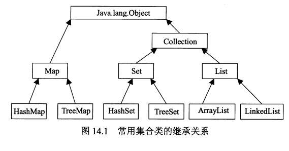
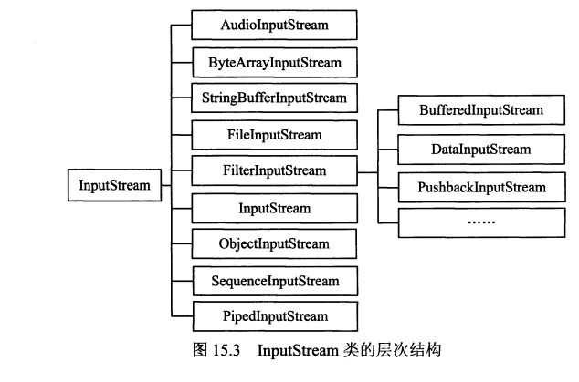
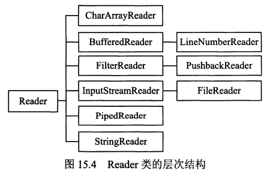
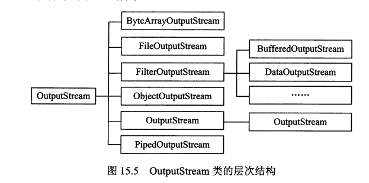
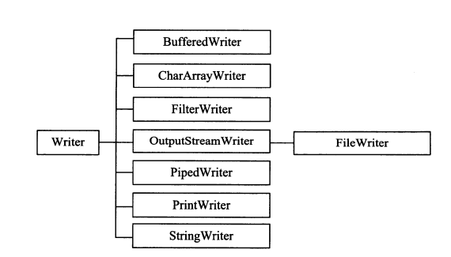

常用类
-------------------
# 集合
一般定义在`java.util`中

**ArrayList**

实现了可变数组，允许保留所有元素。

可以快速地随机访问，但向指定位置插入或删除元素比较慢

**LinkedList**
使用链表的方式保存对象，插入和删除元素快，随机访问对象较慢

**HashSet**
使用哈希表实现，不保证每次迭代的顺序

**TreeSet**
支持排序的Set

#IO流
一般定义在`java.io`中

**InputStream**

一般InputStream是用来处理字节的

**Reader**

一般reader是用来处理字符的

**OutputStream**

一般是用来处理字节的

**Writer**

一般是用来处理字符的

BufferedInputStream

BufferedOutputStream

BufferedReader

BufferedWriter

# 文件操作

原始的文件操作：`java.io.File`

**字节操作**
FileInputStream

FileOutputStream

**字符操作**
FileReader

FileWriter

# 数据操作
用于读写指定类型的数据

DataInputStream
DataOuputStream