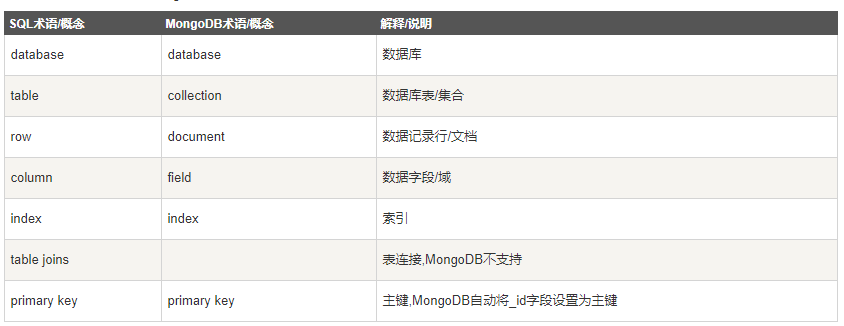
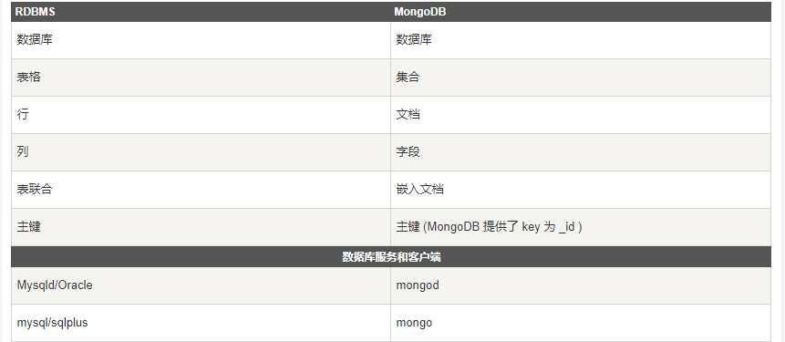

mongodb学习笔记
-----------------------
mongodb是一个由C++语言编写的非关系型数据库

特点
* 使用二进制json(bson)进行具体文档的存储
* 你可以通过本地或者网络创建数据镜像，这使得MongoDB有更强的扩展性。
* 如果负载的增加（需要更多的存储空间和更强的处理能力） ，它可以分布在计算机网络中的其他节点上这就是所谓的分片。
* Mongodb中的Map/reduce主要是用来对数据进行批量处理和聚合操作。
* GridFS是MongoDB中的一个内置功能，可以用于存放大量小文件。

# 安装
* 下载地址：[点此下载](https://www.mongodb.com/download-center/community)
* 使用命令行运行服务器`mongod --dbpath c:\data\db`
* 安装mongodb服务:` mongod.exe --config "C:\mongodb\mongod.cfg" --install`
* 使用客户端连接到服务器`mongo.exe`

# 相关概念

 

说明：
* 一个mongodb可以建立多个数据库，每个数据库都有自己的集合和权限，默认数据库为`db`。

* 数据库名是满足一些要求的utf-8字符
	* 不能是空字符
	* 不得含有' '（空格)、.、$、/、\和\0 (空字符)。
	* 应全部小写。
	* 最多64字节。

* 集合存在于数据库中，集合没有固定的结构，这意味着你在对集合可以插入不同格式和类型的数据，但通常情况下我们插入集合的数据都会有一定的关联性。
	* 集合名不能是空字符串""。
	* 集合名不能含有\0字符（空字符)，这个字符表示集合名的结尾。
	* 集合名不能以"system."开头，这是为系统集合保留的前缀。
	* 用户创建的集合名字不能含有保留字符。有些驱动程序的确支持在集合名里面包含，这是因为某些系统生成的集合中包含该字符。除非你要访问这种系统创建的集合，否则千万不要在名字里出现$。　

* 文档是一组键值(key-value)对(即 BSON)。MongoDB 的文档不需要设置相同的字段，并且相同的字段不需要相同的数据类型，这与关系型数据库有很大的区别，也是 MongoDB 非常突出的特点
	* 文档中的键/值对是有序的。
	* 文档中的值不仅可以是在双引号里面的字符串，还可以是其他几种数据类型（甚至可以是整个嵌入的文档)。
	* MongoDB区分类型和大小写。
	* MongoDB的文档不能有重复的键。
	* 文档的键是字符串。除了少数例外情况，键可以使用任意UTF-8字符。

* 文档命名规范:
	* 键不能含有\0 (空字符)。这个字符用来表示键的结尾。
	* .和$有特别的意义，只有在特定环境下才能使用。
	* 以下划线"_"开头的键是保留的(不是严格要求的)。 

# 常用命令
* 查看数据库:`db`
* 切换到数据库tstdb:`use tstdb`
* 往数据库tstdb写入一个文档:`db.tstdb.insert({x:10,y=1})`
* 数据查找:`db.tstdb.find()`

# 参考资料
