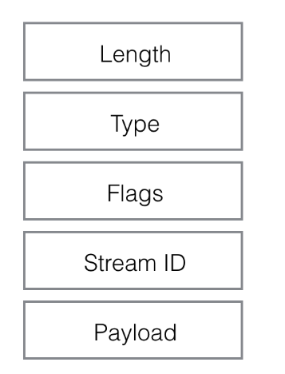

HTTP 详解
---------------------
HTTP 是`Hypertext Transfer Protocol`的缩写，中文译为超文本传输协议。当前存在4个HTTP版本，前三个已经处于使用阶段，第四个才定调。本文将比较简单介绍HTTP 1.0 ，HTTP 1.1，HTTP 2.0内容和要解决的问题。
# HTTP 1.0 概要
HTTP 1.0规定每个TCP连接只处理一次HTTP请求，处理完成后TCP连接立即断开。以通过这种方式节省服务器资源。这在纯文本或少量其他资源的情况下，没有什么问题。但现在，一个网页少则10多个关联文件，多则上百个。而且TCP建立连接需要3次握手，断开连接需要4次挥手并且建立连接过程的RTT(往返时延 Round-Trip Time)。导致建立TCP连接代价太慢。如果淘宝仍然使用HTTP1.0，估计没有人会有购物的欲望了吧。

导致HTTP 1.0如此慢的原因有如下几个因素:
1. 底层的TCP连接无法复用
2. 线头阻塞（head of line blocking），一般PC端浏览器只会对单个域名建立6到8个连接，手机端的连接数一般控制在4到6个。超过这个连接后，请求会被阻塞

HTTP 1.0存在的其他问题
1. 同服务器的一个端口只能有一个站点，由于默认只有80对外提供HTTP服务。这导致要么要么用其他端口，要么用其他服务器。不管哪种，都是比较要命的作法。
2. 文件不能断点续传


# HTTP 1.1 概要
HTTP 1.1在HTTP1.0的基础上做了很多优化：
1. 新增了更多的请求头和呼应，以对供身份认证，状态管理，Cache缓存，文件断点续传提供支持
2. 新增Host请求头，以对一个端口绑定多个站点提供支持
3. 提供对持久连接的支持（请求时，添加Keep-Alive头），提供HTTP 管线化(HTTP pipelining)技术，把多个HTTP请求放到同一个TCP连接中一一发送，发送过程中不需要等待服务器返回，但服务器端会对请求进行排除，按照先进先出(FIFO)的方式返回请求内容。这个过程中，某个请求不能临时更换TCP连接。

HTTP1.1存在的问题：
1. 线头阻塞（head of line blocking），一个TCP连接里如果前面需要传输一个较大文件，会直接阻塞后面排队的请求，也就是说线头阻塞问题并没有得到解决。
2. 在网络质量较差的情况下,管线化(HTTP pipelining)技术会让延迟更高（TCP的重传机制导致）。这导致浏览器一般没有打开这个功能。

为了减少TCP的连接建立数量，这个过程中诞生了一些有意思的技术：
1. CSS 文件内联(inline)， 直接把图片数据内嵌到css文件中
```
<imgsrc="data:image/png;base64,iVAGRw0KGDCFGNSUhEUgACBBQAVGADCAIATYJ7ljmRGGAAGElEVQQIW2P4DwcMDAxAfBvMAhEQMYgcACEHG8ELxtbPACCCTElFTEVBQmGA" />
```

  格式：data:{文件名};{数据编码方式},{编码后的数据内容}
2. Spriting 图片合并技术，把多个图片内容合并到一张大图中，然后使用css进行截图，就像这样

3. JS文件合并 Concatenation，将多个JS文件合并为一个文件
4. 服务分片 Sharding，把资源分散在不同域名下面，从而可以让前端建立更多的连接，以提高呼应速度

# HTTP 2.0 概要
HTTP 2.0  采用二进制，以数据帧的方式进行数据传输。在帧的基础上，抽象出上层应用的流的概念，最终以流的方式实现**多路复用**。

如上图，一个HTTP 2.0的帧由5部分组成：Length:整个请求帧的总长度；Type:帧类型（一共10种）；Flags:一些配置参数；StreamId：一个uint32类型的流唯一标记；Payload:请求内容

**header压缩**，由于HTTP请求中包含了cookie和agent，这导致很多时候header部分比较大，因此HTTP 2.0 要求通信双方都cache一份header fields表，每次通信时，都只传送header的改变量。并在交互时采用[HPACK](https://http2.github.io/http2-spec/compression.html)压缩算法对header进行压缩。压缩头部是出于对TCP机制本身的考虑，具体参考以下引文。

> 大家都知道tcp有slow start的特性，三次握手之后开始发送tcp segment，第一次能发送的没有被ack的segment数量是由initial tcp window大小决定的。这个initial tcp window根据平台的实现会有差异，但一般是2个segment或者是4k的大小（一个segment大概是1500个字节），也就是说当你发送的包大小超过这个值的时候，要等前面的包被ack之后才能发送后续的包，显然这种情况下延迟更高。intial window也并不是越大越好，太大会导致网络节点的阻塞，丢包率就会增加-----HTTP 2.0的那些事

**多路复用(MultiPlexing)**，帧的结构中有一个StreamId，它是上层HTTP请求的一个唯一标识。也就是说，在接受到上层HTTP请求后，HTTP 2.0会把请求转换到帧数据中，并为每个请求分配一个唯一Id，以便后应答数据关联起来。TCP连接最终承载的是帧数据，所以最终可以在一个TCP连接上并发交互多个HTTP请求。当然，HTTP2.0有提供重置流的功能，在需要中断流的情况下，可以传输中断帧来中断这个流。

**服务器推送（server push）**，服务器可以在响应前端请求时，额外推送一些和当次请求无关的数据到前端。比如请求jquery.js文件时，一般也会需要jquery.css，服务器直接在请求jquery.js时，把jquery.css推送给前端。

**流量控制(Flow Control)** 数据的接收方通过告知对方自己的flow window大小表明自己还能接收多少数据。只有Data类型的frame才有flow control的功能。对于flow control，如果接收方在flow window为零的情况下依然收到更多的frame，则会返回block类型的frame，这张场景一般表明http2.0的部署出了问题。只有帧都会受到流量控制。

**优先级和依赖性** 每个流都有一个优先级标识，当资源有限的时候，服务器会根据优先级来选择应该先发送哪些流。在发送优先级信息帧时，可以指定当前流依赖哪个流。从而让客户端建立一个优先级“树”， 所有“子流”会依赖于“父流”的传输完成情况。当然这个优先级和依赖性都是可以动态改变的。

# 总结
关于HTTP的介绍先到这里。其实HTTP 2.0并不是完美的，它仍然存在很多问题。具体的将会在后续文章中详细说明存在的问题，和HTTP3的最新情况

# 参考资料
* [HTTP/2 官网 https://http2.akamai.com](https://http2.akamai.com)
* [HTTP/2 github站点 https://http2.github.io](https://http2.github.io)
* [HTTP、HTTP2.0、SPDY、HTTPS 你应该知道的一些事 https://www.cnblogs.com/wujiaolong/p/5172e1f7e9924644172b64cb2c41fc58.html](https://www.cnblogs.com/wujiaolong/p/5172e1f7e9924644172b64cb2c41fc58.html)
* [What is HTTP/2 – The Ultimate Guide  https://kinsta.com/learn/what-is-http2/](https://kinsta.com/learn/what-is-http2/)
* [Http 2.0协议简介 https://www.jdon.com/dl/http2.html](https://www.jdon.com/dl/http2.html)
* [HTTP2.0 原理详解 http://www.cnblogs.com/zhuimengzhe/p/7290156.html](http://www.cnblogs.com/zhuimengzhe/p/7290156.html)
* [HTTP,HTTP2.0,SPDY,HTTPS你应该知道的一些事 http://www.alloyteam.com/2016/07/httphttp2-0spdyhttps-reading-this-is-enough/](http://www.alloyteam.com/2016/07/httphttp2-0spdyhttps-reading-this-is-enough/)
* [http2讲解 https://legacy.gitbook.com/book/ye11ow/http2-explained/details](https://legacy.gitbook.com/book/ye11ow/http2-explained/details)
* [HTTP 2.0的那些事 https://www.cnblogs.com/zlingh/p/5887143.html](https://www.cnblogs.com/zlingh/p/5887143.html)