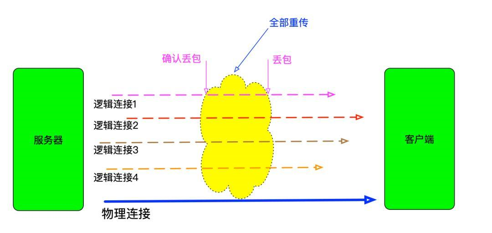
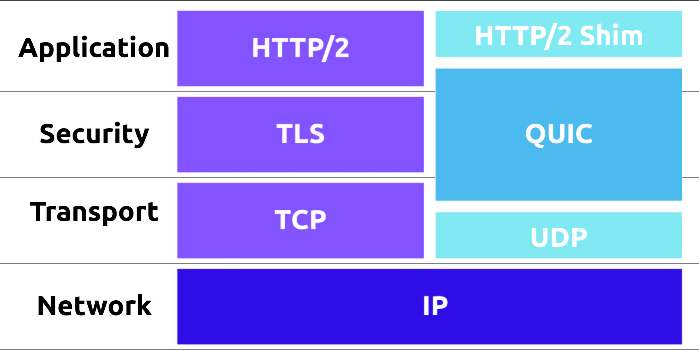
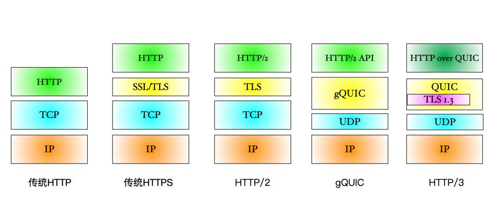

HTTP 的那些事（续）
-------------------------

# 前言
HTTP 2.0是由谷歌SPDY进化而来，现有的实现基本都是走SSL（说是可以不用SSL，但基本没这么干的），传输层使用TCP。
HTTP 3.0是由谷歌QUIC进化出来的，QUIC没有大动HTTP 2.0，在把传输层调整为UDP后，为适应UDP而做了一些微调。

# HTTP 2问题
前篇已整体介绍HTTP 2，就此，此篇只说下HTTP/2的问题

1. 在底层使用了TCP的情况下，TCP的慢启动；拥塞窗口尺寸设置不合理导致的性能急剧下降的问题没有得到解决。基因在此，无法改变
2. HTTP 2多路复用只是减少了连接数，队头阻塞的问题并没有得到完全解决。如果TCP丢包率超过2%，HTTP/2表现将不如HTTP1.1。因为HTTP1 是分开使用的TCP连接,具体对比如下示意图所示：



# HTTP 3
HTTP 3是在QUIC基础上发展出来的。底层使用UDP进行数据传输，但上层仍然使用HTTP/2。HTTP2与UDP之前存在一个QUIC层，TLS加密过程在此层处理。QUICK存在两个版本，早期Google打头阵的QUIC称之为gQUIC，IETF标准化后称之为IQUIC。与HTTP对比，HTTP/3整体如下:



整个HTTP家族对比如下：



HTTP3特点:

1. **使用UDP作为传输层进行通信**
2. **从协议本身保证了安全性**，QUIC在建立连接的握手过程中就完成了TLS加密握手
3. **建立连接快**，正常只需要1RTT即可建立连接。如果有缓存之前的secret信息，则直接验证和建立连接，此过程0RTT。建立连接时，也可以带有少量业务数据。


4. **不和具体底层连接绑定**，QUIC为每个连接的两端分别分配了一个唯一ID，上层连接只认这对逻辑ID。网络切换或者断连时，只需要继续发送数据包即可完成连接的建立
5. **使用QPACK进行头部压缩**，因为HPACK要求传输过程有序，这会导致队头阻塞。而QPACK不存在这个问题
6. HTTP/3在header中定义了一个新header:``Alt-Svc: h3=":20003"``:表示服务器在20003端口开了一个20003端口用于HTTP/3服务

# 补充

* 使用以下代码可以判断是否有使用HTTP/2
```
(function(){
    // 保证这个方法只在支持loadTimes的chrome浏览器下执行
    if(window.chrome && typeof chrome.loadTimes === 'function') {
        var loadTimes = window.chrome.loadTimes();
        var spdy = loadTimes.wasFetchedViaSpdy;
        var info = loadTimes.npnNegotiatedProtocol || loadTimes.connectionInfo;
        // 就以 「h2」作为判断标识
        if(spdy && /^h2/i.test(info)) {
            return console.info('本站点使用了HTTP/2');
        }
    }
    console.warn('本站点没有使用HTTP/2');
})();
```
* QUIC详细介绍-->[维基百科](https://en.wikipedia.org/wiki/QUIC)
* QPACK详细介绍-->[点击此处](https://quicwg.org/base-drafts/draft-ietf-quic-qpack.html)
# 参考资料
* [关于HTTP/3背后你所不知道的 ](https://www.jdon.com/50807)
* [HTTP/3 来啦，你还在等什么？赶紧了解一下](https://www.codercto.com/a/38070.html)
* [What is the QUIC Transport Protocol?](https://www.callstats.io/blog/what-is-the-quic-transport-protocol)
* [我的HTTP/3学习笔记](https://www.javazhiyin.com/32997.html)
* [一文读懂 HTTP/2 及 HTTP/3 特性](https://blog.fundebug.com/2019/03/07/understand-http2-and-http3/)