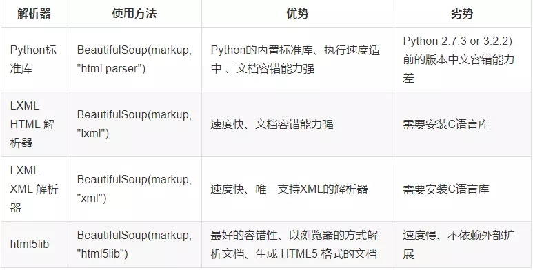

python抓取网站--BeautifulSoup
----------------------------------
# 前言

最近项目将要接入一套面向大型RPG的日志搜集服务。但当前游戏是挂机类的，很多都要硬接上去，怎一个无力也得。为了简化从文档到golang代码的编写，于是基于日志文档使用python写了个生成所需golang代码的工具，非常好用，当然主要使用到的就是很有名的BeautifulSoup组件。

# 简介
[Beautiful Soup](https://beautifulsoup.readthedocs.io/zh_CN/v4.4.0/#)是一个用于解析Html或XML数据的python库，它可以方便地集成其他解析库,支持的三方组件如下



# 使用
本次将使用lxml作为解析组件进行编码，并使用python 3.6作为运行环境

**下载库**
````
pip install lxml
pip install beautifulsoup4
````

**使用**
````
#!/usr/bin/python3
# -*- coding: UTF-8 -*-

from bs4 import BeautifulSoup
import urllib.request

# 获取网页内容
tmpHtml=urllib.request.urlopen("https://www.baidu.com").read()

# 解析网页
soup = BeautifulSoup(tmpHtml,"lxml")

# 使用css选择节点
soup.select("li[class=chapter]")

# 查找所有a标签
tag=soup.find("a")
print("标签名:%s"%(tag.name))

print("标签属性操作:%s"%(tag.attrs["id"]))
````
以上只是简单罗列，如需更详细的使用可以阅读官方文档或以下参考资料

# 参考文档
* [Beautiful Soup 4.4.0 官方文档](https://beautifulsoup.readthedocs.io/zh_CN/v4.4.0/)
* [beautifulsoup模块使用详解](https://blog.csdn.net/lu8000/article/details/82313054)
* [BeautifulSoup 简书](https://www.jianshu.com/p/538e2e9c2a03)
* 