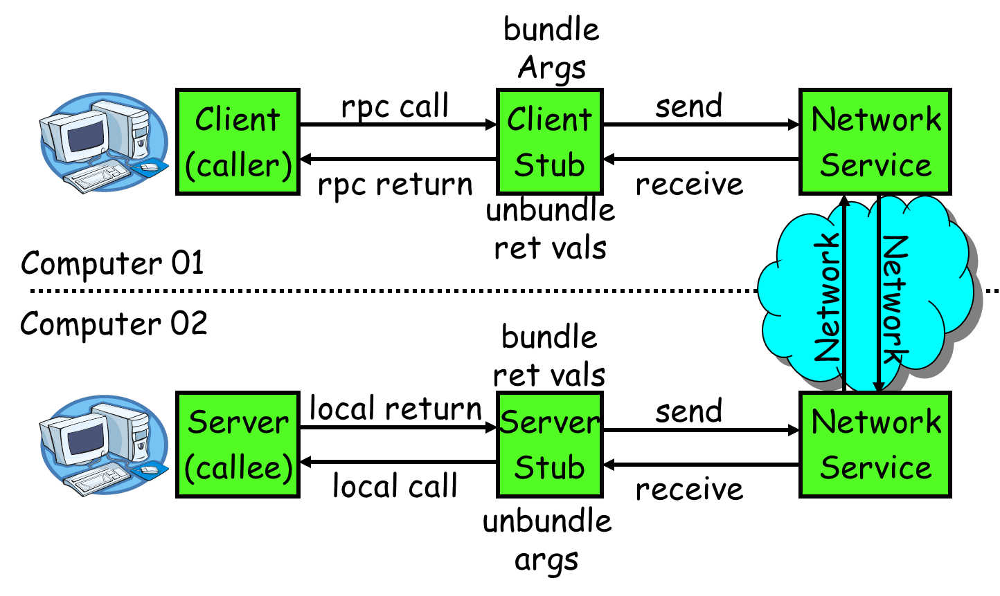

RPC概要
-----------------
RPC全称为`Remote Procedure call`中文译为远程过程调用。其目的是简化进程间通信，使调用其他进程提供的服务就像调用本地接口一样简单。RPC一般有如下特点：

* **C/S结构** RPC一般是服务端实现对某个逻辑的封装，客户端通过客户端实现来访问服务端。

* **底层透明** RPC整个调用过程不用关心底层实现，完整的RPC框架会解决内部通信过程

* **包含服务端实现和客户端实现** RPC会封装客户端和服务端底层通信和调用

* **使用简单** 比较流行的框架一般会提供一种中间语言定义RPC接口，并会直接生成对应代码。整个调用过程基本感知不到跨进程。和调用本地函数并无太大区别

RPC整体结构如下图所示：

从上图可以看出RPC主要有4个部分：

1. **Client调用方** 调用方业务实现部分

2. **Client调用封装** 对RPC通信细节的封装

3. **Server调用封装** 对RPC通信细节的封装和对服务端接口的管理

4. **Server服务实现** 对提供的服务接口的具体实现

其中，Client调用封装和Server调用封装一般由三方RPC框架实现。具体来说，RPC框架一般包含以下内容：

1. **应用层通信协议设计和实现** 这是RPC基础与核心，它将是Client/Server通信的链路。通信协议应该考虑如下一些问题：

  * **请求应答如何关联** 协议需要支撑上层的应答关联

  * **如何识别调用的服务器端哪个接口**

  * **安全性问题** 大部分情况，数据细节都不希望被别人监听和窃取，所以需要对此做些考虑

  * **单个数据包最大长度** 对底层而言，最好就是定长协议，因为这会让内存管理变得极其简单。但一般情况下是不可能定长的。此时就需要考虑包体最大长度问题。否则内存一不小心就爆了
  
  * **协议完整性** 整个协议应该是完整的，至少应该能够解析出上层数据。在代价较小或数据极其敏感的情况下，协议需要能够支持防篡改
  
  * **心跳** 并不是所有协议都需要考虑心跳问题，这个需要看实际情况。大部分情况都可以加上心跳逻辑

2. **调用会话管理** RPC调用一般分为两种：同步调用，异步调用。而每次调用都可以称为Session(会话)。会话管理主要内容如下：

	* **关联调用请求和应答数据** 也就是说，在收到应答包时，需要把应答数据关联到对应会话上，以便能够通知调用方已收到应答数据

	* **处理请求超时问题** 并不是每次请求都能如期完成，会话管理需要确保所有调用都能返回。超过预期时间后，需要告知上层，避免调用方死等

	* **如何通知调用线程** 这也是会话管理需要处理的问题，很多时候，这个需要借助语言特性才能工作更好。如果是使用操作系统相关API，效率将一般不会太高

3. **如何发现服务端有哪些服务需要对外提供** 这是整个RPC框架对外提供接口时需要考虑的，也是外部能够感知到的一部分。一般这需要借助具体编程语言的特性才能对开发友好

4. **对客户端调用需要封装到什么地步，以什么方式提供** 这是整个RPC框架对客户端提供的接口部分。理想的接口形式就是和本地接口完全一致，调用方完全感知不到是访问的外部进程

其实只要一个一个解决以上问题，一个完整RPC框架便基本成型。但这样的RPC框架或许只能自己用着玩，要达到可落地程度则还需要考虑以下几个问题，这将是选择使用哪个RPC框架的重要依据：

* **资源消耗问题** 好的RPC框架框架本身消耗的资源极少，他会把更多的资源留给业务层，以便更加有效地利用系统资源。其中资源包含：网络带宽消耗，内存消耗，CPU消耗。RPC框架都需要合理规划这些方面的资源消耗

* **调用过程时延问题** 当然，理想情况是RPC调用过程是不会造成额外时延，但却是无法做的。因为，网络本身会有时延，请求过程中的数据序列化，反序列化，拆包，解包都会造成时延。另外，应答通知上层过程也可能会造成时延

* **调用效率问题** 很多RPC框架都以每秒可以处理多少次请求为标准，证明自己RPC框架效率如何高。这对实际的RPC框架选型有很大的指导意义

# 总结

现有已经有很多RPC框架，这些也基本能满足我们日常所有需求。比如：Hessian，WebService，RMI，Thrift，Dubbo，Grpc

但有时，我会有这样一种需求。RPC需要同时对内部系统提供，对外网三方系统提供这时就需要RPC能够支持多种数据格式。另外，有时也需要RPC提供方主动给调用方发送一些数据。这些情况下，现有的RPC框架一般都没有解决（因为RPC侧重在服务提供）。所以，在接下来的文章中，我将自行设计和实现一个RPC框架。或许有些考虑不全，欢迎大家补充

# 参考资料
* [RPC入门总结（一）RPC定义和原理](https://blog.csdn.net/kingcat666/article/details/78577079)
* [RPC原理及RPC实例分析](https://my.oschina.net/hosee/blog/711632)
* [深入浅出 RPC - 浅出篇](https://blog.csdn.net/mindfloating/article/details/39473807)
* [深入浅出 RPC - 深入篇](https://blog.csdn.net/mindfloating/article/details/39474123)

# 写在最后

本公众号将持续推送游戏后端开发相关文章，大家记得扫码关注哦

