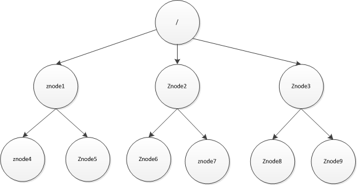
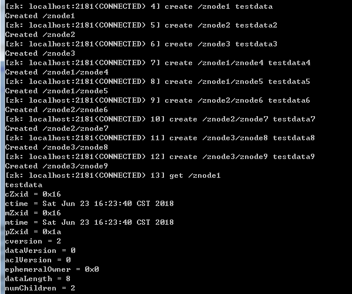
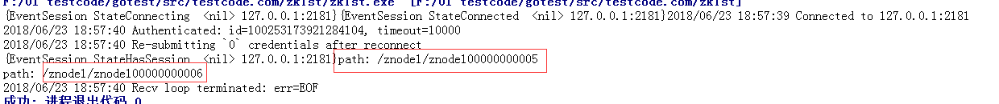
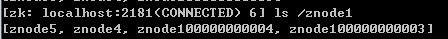

zookeeper学习笔记--节点篇
--------------------
## 前言
本文将着重介绍zookeeper的节点相关的信息。不涉及原理及详细的指令。仅对节点相关信息进行详细说明。
## zookeeper是什么
zookeeper是一个支持分布式的应用程序协调服务。提供：配置数据管理、分布式同步，类似文件路径的格式的节点描述格式，支持节点变更通知。这极大降低了分布式系统的复杂度

## zookeeper数据模型详解

如上图所示，zookeeper节点称之为znode，以**/**为根节点，支持增删改子节点。子节点通过类似文件路径的方式进行定位。例如，znode4的路径为:"/znode1/znode4"。

zookeeper节点命名规则如下：
1. 空字符不能作为路径名称；
2. 以下字符串不能作为使用，这是优越它们显示不够友好，或容易引起混淆（\u0001 - \u001F and \u007F - \u009F）
3. 以下字符串是不允许的。（ \ud800 - uF8FF, \uFFF0 - uFFFF）
4. "."字符可以作为名称的一部分，但是"."和".."不能单独存在用于表示一个节点的路径，因为ZooKeeper没有使用相对路径。下述例子是无效的"/a/b/./c" or "/a/b/../c"
5. "zookeeper"关键字保留

**对所有节点的访问都必须是以根节点打头。也就是说不存在相对路径的说法**。


如上图所示，每个节点包含的信息有：
* cZxid:创建的事务id
* ctime：创建时间
* mZxid：修改的事务Id
* mtime：修改时间
* pZxid：子节点最近一次 创建/删除的事务Id。
* cversion：子节点版本号，由于我添加了2个节点，且未修改过，所以版本号是2
* dataVersion:数据版本号，每修改1次+1
* aclVersion：Access Control List Version,指访问控制版本号，每进行一次控制权限调整，则版本号+1。
 1. ACL定义了5种控制权限：
	 * CREATE:创建子节点的权限
	 * READ:获取节点数据和子节点列表的权限
	 * WRITE：更新节点数据的权限
	 * DELETE：删除子节点的权限
	 * ADMIN:设置节点ACL的权限
 2. 身份认证方式有4种：
	 * world：默认方式，相当于全世界都能访问
	 * auth：代表已经认证通过的用户(cli中可以通过addauth digest user:pwd 来添加当前上下文中的授权用户)
	 * digest：即用户名:密码这种方式认证，这也是业务系统中最常用的
	 * ip：使用Ip地址认证
* ephemeralOwner：
* dataLength：数据的字节数
* numChildren:直属的子节点数量

## znode分类
znode按照条件:生命周期、是否有序对节点进行分类，**这两个属性都需要在节点创建时指定**。

生命周期分类
* 持久： 在节点创建后将一直存在，直到被主动删除为止。不会因为创建此节点的client退出而消失。通过cli创建的节点，默认是持久节点。

* 临时：临时节点是和client会话绑定在一起的。如果和client的会话失效。则此节点就会自动被删除。
  重要说明：
  * 会话失效：client和zookeeper心跳超时也会导致会话失效。也就是说会话失效不只是连接断开
  * 临时节点不能创建子节点

是否有序分类 
* 有序： **每个父节点会为他的子节点维护一份时序，以记录每个子节点的创建先后顺序**。子节点在创建时，如果有设置这一属性，那么zk会自动给节点名添加一个数字后缀，数字后缀的上限是整型的最大值

* 无序： 创建节点默认是无序的。
重要说明：
  * 一个持久节点可以同时拥有无序节点和有序节点

最终按照以上条件节点分为4类：
* 持久节点(PERSISTENT)
* 持久顺序节点(PERSISTENT_SEQUENTIAL)
* 临时无序节点(EPHEMERAL)
* 临时有序节点(EPHEMERAL_SEQUENTIAL)

## 节点创建示例
代码创建持久有序节点(golang):
```
package main

import (
	"fmt"
	"time"

	"github.com/samuel/go-zookeeper/zk"
)

func main() {
	conObj, eventCh, err := zk.Connect([]string{"127.0.0.1:2181"}, 10*time.Second)
	if err != nil {
		fmt.Println("连接出错:", err.Error())
		return
	}

	go func() {
		for {
			select {
			case item := <-eventCh:
				{
					fmt.Printf("%v", item)
				}
			}

		}
	}()

	val, err := conObj.Create("/znode1/znode10", []byte(""), zk.FlagSequence, zk.WorldACL(zk.PermAll))
	if err != nil {
		fmt.Println("err:", err.Error())
	} else {
		fmt.Println("path:", val)
	}

	val, err = conObj.Create("/znode1/znode10", []byte(""), zk.FlagSequence, zk.WorldACL(zk.PermAll))
	if err != nil {
		fmt.Println("err:", err.Error())
	} else {
		fmt.Println("path:", val)
	}

	conObj.Close()
}

```
输出结果：


zkCli.sh创建持久有序节点：
```
create -s /znode1/znode10 ""
```
我的版本是:3.4.9,一执行创建顺序节点就会cli崩溃，暂未找到原因。所以就没有截图出来。最终通过cli查看节点列表如下图：


# TODO
由于最近比较关注节点相关信息，所以特此详细总结。后面将会补足从原理到编码的相关文章-_-~
1. zookeeper学习笔记--原理篇
2. zookeeper学习笔记--搭建篇
3. zookeeper学习笔记--code篇

# 参考资料
* [Zookeeper中节点属性中的 三个 Zxid](https://blog.csdn.net/xzx735/article/details/30152769)
* [Zookeeper 3、Zookeeper工作原理（详细）](https://www.cnblogs.com/raphael5200/p/5285583.html)
